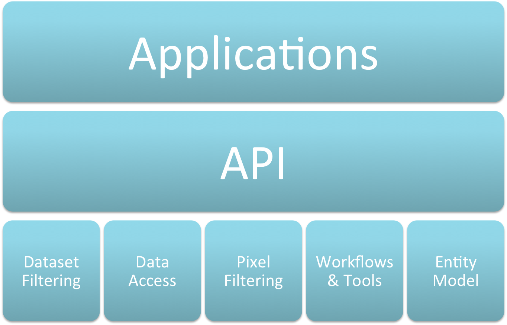

.. toctree::
   :maxdepth: 2

API Overview
============

Model Entities
--------------

.. image:: model_entities.png

Dataset Filtering (aka Querying)…
---------------------------------

* List cells or datasets
* List present or missing
* Spatial criteria – x/y or region/AOI (WKT/WKB directly or from vector file)
* DB result set or (to) CSV
* NBAR, PQA, FC, DSM/DEM
* WOFS – currently “fudged” until ingested
* Virtual datasets (NDVI, EVI, Tassel Cap, NBR, …)

List Cells
++++++++++

List cells for which we DO have matching datasets…

For e.g. LS8 acquired in 2014 for which we DO have NBAR, PQA and DSM…::

    list_cells(x=range(120, 125), y=[-20],
               acq_min=datetime(2014,1,1),
               acq_max=datetime(2014,12,1),
               satellites=[LS8], dataset_types=[ARG25, PQ25, DSM])

    (120, -20)
    (121, -20)
    (122, -20)
    (123, -20)
    (124, -20)

List cells for which we have DON’T have matching datasets….

For e.g. LS8 acquired in 2014 for which we don’t have FC…::

    list_cells_missing(x=range(120, 125), y=[-20],
                      acq_min=datetime(2014, 01, 01),
                       acq_max=datetime(2014, 12, 31),
                       satellites=[LS8],dataset_types=[FC25])

    (121, -20)
    (122, -20)
    (123, -20)

List Datasets
+++++++++++++

List matching datasets…

For e.g. LS8 acquired in Q1 of 2014 for which we DO have NBAR, PQA and DSM datasets…::

    list_datasets(x=range(120, 125), y=[-20],
                  acq_min=datetime(2014,1,1),
                  acq_max=datetime(2014,3,31),
                  satellites=[LS8],dataset_types=[ARG25, PQ25, DSM])

    (120, -20) 2014-01-10 02:03:44 /g/data/… /g/data/… /g/data/…
               …
               2014-03-31 02:02:42 /g/data/… /g/data/… /g/data/…

    (121, -20) 2014-02-04 01:57:19 /g/data/… /g/data/… /g/data/…
               …
               2014-02-13 01:50:34 /g/data/… /g/data/… /g/data/…

    (123, -20) 2014-02-13 01:50:34 /g/data/… /g/data/… /g/data/…

List missing datasets…

For e.g. LS8 acquired in 2014 for which we don’t have FC…::

    list_datasets_missing(x=range(120, 125), y=[-20],
                          acq_min=datetime(2014,1,1),
                          acq_max=datetime(2014,3,31),
                          satellites=[LS8],dataset_types=[FC25])

    (120, -20) 2014-01-10 02:03:44 /g/data/…/LS8_NBAR…
               …
               2014-03-31 02:02:42 /g/data/…/LS8_NBAR…

    (121, -20) 2014-02-04 01:57:19 /g/data/…/LS8_NBAR…
               …
               2014-02-13 01:50:34 /g/data/…/LS8_NBAR…

    (123, -20) 2014-02-13 01:50:34 /g/data/…/LS8_NBAR…

List ... by AOI…
++++++++++++++++

The same but WKT or vector file rather than x/y range…::

    list_cells_wkt(wkt=“POLYGON(…)”, …)
    list_cells_vector_file(file=, layer=, feature=, …)

    list_datasets_wkt(wkt=“POLYGON(…)”, …)
    list_datasets_vector_file(file=, layer=, feature=, …)

    …

List … to CSV…
++++++++++++++

The same but “_to_csv”…::

    list_cells_to_csv(x, y, …, filename)
    list_cells_missing_to_csv(x, y, …, filename)

    list_datasets_to_csv(x, y, …, filename)
    list_datasets_missing_to_csv(x, y, …, filename)

    …

Data Access
-----------

You provide a “dataset” (e.g. from a list query) and you get back numpy array(s)

All data or some data – subset by band, space or both::

    # all data in all bands
    get_dataset_data(datasets[ARG25])

    # all data in RED & GREEN bands
    get_dataset_data(datasets[ARG25], bands=[RED, GREEN])

    # 50x50 pixels starting at (100, 100) in RED & GREEN bands
    get_dataset_data(datasets[ARG25], bands=[RED, GREEN], 100, 100, 50, 50)

Physical datasets – NBAR, PQA, FC, DSM, WOFS, …

Virtual datasets – NDVI, EVI, NBR, Tassel Cap, ….  Behind the scenes, a virtual dataset points at (a currently SINGLE) physical dataset…::

    # all data in all bands in dataset
    get_dataset_data(datasets[NDVI])

    # all data in all bands in dataset
    get_dataset_data(datasets[TCI])

    # 50x50 pixels starting at (100, 100)
    get_dataset_data(datasets[NDVI], 100, 100, 50, 50)

In future “bring your own datasets”

For e.g. ability to treat your own (intermediate) outputs as fully fledged data cube datasets

Maybe – haven’t thought my way through all the how’s and why’s of this yet…

Pixel Filtering (aka Masking)
-----------------------------

* Replaces pixel value with NDV
* PQA
* WOFS
* NDVI
* Range of values
* AOI

PQA, WOFS, masking…
+++++++++++++++++++

Get FC data with non-clear and water pixels masked out…::

    mask = None

    mask = get_mask_pqa(datasets[PQ25], [PQA_MASK_CLEAR], mask)
    mask = get_mask_wofs(datasets[WATER], [WATER], mask)

    data = get_dataset_data_masked(datasets[FC25], mask, NDV)

Value range masking…
++++++++++++++++++++

Get FC data with additional masking for values outside 10% - 80% bare soil range…::

    mask = None

    mask = get_mask_pqa(datasets[PQ25], [PQA_MASK_CLEAR], mask)
    mask = get_mask_wofs(datasets[WATER], [WATER], mask)

    data = get_dataset_data_masked(datasets[FC25], mask, NDV)

    mask = get_mask_range(data[BARE_SOIL], 1000, 8000, mask)

    data = apply_mask(data, mask)

NDVI Value range masking…
+++++++++++++++++++++++++

Get FC data with additional masking for NDVI values outside 0 to 0.3 range…::

    mask = None

    mask = get_mask_pqa(datasets[PQ25], [PQA_MASK_CLEAR], mask)
    mask = get_mask_wofs(datasets[WATER], [WATER], mask)

    data = get_dataset_data_masked(datasets[FC25], mask, NDV)

    mask = get_mask_range(data[BARE_SOIL], 1000, 8000, mask)

    mask = get_mask_range(datasets[NDVI], 0.0, 0.3, mask)

    data = apply_mask(data, mask)

AOI masking…
++++++++++++

Apply an AOI mask…::

    mask = None

    mask = create_aoi_mask_for_cell(file=, layer=, feature=, x=, y=)

    data = get_dataset_data_masked(datasets[FC25], mask, NDV)

AOI masking – An ACTual example…
+++++++++++++++++++++++++++++++++

Lets do some analysis on surface reflectance with an AOI of the ACT…

Start with the AGDC surface reflectance data…

.. image:: agdc-clean_pixel_ls8_nbar_2014_12_31_agdc-australian_grid.png

…and AOI in a vector (shape, KML, etc) file…

.. image:: agdc-australian_states-ALL.png

…and let's focus in on the ACT…

…find the CELLs that cover the ACT…::

    list_cells_vector_file(file=“australian_states.shp”, 
                           layer=“australian_states”, 
                           feature=4, …)

    (148, -36)
    (149, -36)

…grab some NBAR datasets for those cells (148/-36 & 149/-36) from the cube…::

    for dataset in list_datasets_vector_file(file=“australian_states.shp”, 
                                             layer=“australian_states”, 
                                             feature=4, …):

        get_dataset_data(datasets[ARG25])

…which gives us…

.. image:: agdc-LS_NBAR_ACT_agdc-australian_states_agdc-australian_grid_148_-036.png

…and then adding in AOI masking…::

    for cell in list_cells_vector_file(file=“australian_states.shp”, 
                                       layer=“australian_states”, 
                                       feature=4, …):

        mask = None

        mask = create_aoi_mask_for_cell(file=“australian_states.shp”,
                                       layer=“australian_states”,
                                       feature=4,
                                       x=cell.x, y=cell.y)

        data = get_dataset_data_masked(datasets[ARG25], mask, NDV)

…which gives us…

…and maybe mosaic them together…

…and apply your favourite analysis formula(ae)…

Workflows
---------

.. image:: workflow.png

A workflow:

* takes input(s);
* does “stuff”; which
* turns the inputs into output(s)…

Have been driven by the applications:

* Landsat Clean Pixel Mosaic
* Bare Soil
* Wetness in the Landscape
* CRCSI March (Adam’s version(s))
* CRCSI March (Leo’s version(s))
* WOFS
* …

Cell Based Workflows…
+++++++++++++++++++++

.. image:: workflow_cell.png

**PQA Observation Count Example…**

To help validate/improve the PQA algorithm more information about the PQA outputs was desired

For e.g. for each pixel show how many times it was:

  * Observed (in total and “clearly” as per PQA)
  * Classified as “unclear” on the basis of each of the PQA flags (contiguity, saturation, cloud, cloud shadow, …)

So get an output raster for each cell with a band representing each of the above

This is a *Cell* workflow:

* Extend the abstract cell workflow with:

  * ``ObservationCountWorkflow`` which extends ``cell.Workflow``
  * ``ObservationCountSummaryTask`` which extends ``cell.SummaryTask``
  * ``ObservationCountCellTask`` which extends ``cell.CellTask``

.. code-block:: python
    :caption: ``ObservationCountWorkflow``…

    class ObservationCountWorkflow(cell.Workflow):
        def create_tasks(self):
            return [ObservationCountSummaryTask(x_min=, x_max=, …)]

.. code-block:: python
    :caption: ``ObservationCountSummaryTask``…

    class ObservationCountSummaryTask(cell.SummaryTask):
        def create_cell_task(self):
            return [ObservationCountCellTask(x=, y=, …)]

.. code-block:: python
    :caption: ``ObservationCountCellTask``…

    class ObservationCountCellTask(cell.CellTask):
        def output(self):
            return LocalTarget(“{satellite}_OBS_{x}_{y}_{acq_min}_{acq_max}.tif”

        def run(self):

            [obs_count[b] = empty_array() for b in [TOTAL CLEAR CONTIGUITY …]]        

            for tile in self.get_tiles():
                data = get_dataset_data(datasets[PQ25])

            obs_count[TOTAL] += 1

            for mask in [CLEAR CONTIGUITY … CLOUD CLOUD_SHADOW …]:
                obs_count[mask] += numpy.where(data == mask, 1, 0)

            raster_create(self.output().path, data=obs_count,…)

Cell Chunk Based Workflows…
+++++++++++++++++++++++++++

Process a cell in manageable chunks…

Cell Dataset Band Based Workflows…
++++++++++++++++++++++++++++++++++

Process a dataset / dataset band…

Cell Dataset Band Chunk Based Workflows…
+++++++++++++++++++++++++++++++++++++++++

Process a dataset / dataset band in manageable chunks…

Band Stack Workflow…
+++++++++++++++++++++++++++++++++++++++++

The *Band Stack* workflow is a specific instance of the *Cell Dataset Band* workflow which produces a set of band stack
outputs.  It can be run as a stand-alone workflow or the individual tasks incorporated into other workflows.

The class structure is:

* ``BandStackWorkflow`` which extends ``datacube.api.workflow.cell_dataset_band.Workflow``
* ``BandStackSummaryTask`` which extends ``datacube.api.workflow.cell_dataset_band.SummaryTask``
* ``BandStackCellTask`` which extends ``datacube.api.workflow.cell_dataset_band.CellTask``
* ``BandStackCellDatasetBandTask`` which extends ``datacube.api.workflow.cell_dataset_band.CellDatasetBandTask``

It can be run as::

    $ band_stack.py --x-min 120 --x-max 120 --y-min -20 --y-max -20 --satellite LS5 LS7 LS8 --acq-min 2013-12 --acq-max 2013-12 --dataset-type ARG25 --mask-pqa-apply --output-directory /tmp --local-scheduler --workers 16 --output-format ENVI

which produces::

    $ ls -lh

    -rw-r----- 1 sjo547 u46 153M May  5 10:13 LS578_NBAR_WITH_PQA_STACK_BLUE_120_-020_2013_12_01_2013_12_31.dat
    -rw-r----- 1 sjo547 u46  775 May  5 10:13 LS578_NBAR_WITH_PQA_STACK_BLUE_120_-020_2013_12_01_2013_12_31.hdr

    -rw-r----- 1 sjo547 u46  92M May  5 10:13 LS578_NBAR_WITH_PQA_STACK_COASTAL_AEROSOL_120_-020_2013_12_01_2013_12_31.dat
    -rw-r----- 1 sjo547 u46  694 May  5 10:13 LS578_NBAR_WITH_PQA_STACK_COASTAL_AEROSOL_120_-020_2013_12_01_2013_12_31.hdr

    -rw-r----- 1 sjo547 u46 153M May  5 10:13 LS578_NBAR_WITH_PQA_STACK_GREEN_120_-020_2013_12_01_2013_12_31.dat
    -rw-r----- 1 sjo547 u46  776 May  5 10:13 LS578_NBAR_WITH_PQA_STACK_GREEN_120_-020_2013_12_01_2013_12_31.hdr

    -rw-r----- 1 sjo547 u46 153M May  5 10:13 LS578_NBAR_WITH_PQA_STACK_NEAR_INFRARED_120_-020_2013_12_01_2013_12_31.dat
    -rw-r----- 1 sjo547 u46  784 May  5 10:13 LS578_NBAR_WITH_PQA_STACK_NEAR_INFRARED_120_-020_2013_12_01_2013_12_31.hdr

    -rw-r----- 1 sjo547 u46 153M May  5 10:13 LS578_NBAR_WITH_PQA_STACK_RED_120_-020_2013_12_01_2013_12_31.dat
    -rw-r----- 1 sjo547 u46  774 May  5 10:13 LS578_NBAR_WITH_PQA_STACK_RED_120_-020_2013_12_01_2013_12_31.hdr

    -rw-r----- 1 sjo547 u46 153M May  5 10:13 LS578_NBAR_WITH_PQA_STACK_SHORT_WAVE_INFRARED_1_120_-020_2013_12_01_2013_12_31.dat
    -rw-r----- 1 sjo547 u46  792 May  5 10:13 LS578_NBAR_WITH_PQA_STACK_SHORT_WAVE_INFRARED_1_120_-020_2013_12_01_2013_12_31.hdr

    -rw-r----- 1 sjo547 u46 153M May  5 10:13 LS578_NBAR_WITH_PQA_STACK_SHORT_WAVE_INFRARED_2_120_-020_2013_12_01_2013_12_31.dat
    -rw-r----- 1 sjo547 u46  792 May  5 10:13 LS578_NBAR_WITH_PQA_STACK_SHORT_WAVE_INFRARED_2_120_-020_2013_12_01_2013_12_31.hdr

    -rw-r----- 1 sjo547 u46  92M May  5 10:10 LS8_FC_WITH_PQA_STACK_BARE_SOIL_120_-020_2013_12_01_2013_12_31.dat
    -rw-r----- 1 sjo547 u46  662 May  5 10:10 LS8_FC_WITH_PQA_STACK_BARE_SOIL_120_-020_2013_12_01_2013_12_31.hdr

    -rw-r----- 1 sjo547 u46  92M May  5 10:10 LS8_FC_WITH_PQA_STACK_NON_PHOTOSYNTHETIC_VEGETATION_120_-020_2013_12_01_2013_12_31.dat
    -rw-r----- 1 sjo547 u46  682 May  5 10:10 LS8_FC_WITH_PQA_STACK_NON_PHOTOSYNTHETIC_VEGETATION_120_-020_2013_12_01_2013_12_31.hdr

    -rw-r----- 1 sjo547 u46  92M May  5 10:10 LS8_FC_WITH_PQA_STACK_PHOTOSYNTHETIC_VEGETATION_120_-020_2013_12_01_2013_12_31.dat
    -rw-r----- 1 sjo547 u46  678 May  5 10:10 LS8_FC_WITH_PQA_STACK_PHOTOSYNTHETIC_VEGETATION_120_-020_2013_12_01_2013_12_31.hdr

    -rw-r----- 1 sjo547 u46  92M May  5 10:10 LS8_FC_WITH_PQA_STACK_UNMIXING_ERROR_120_-020_2013_12_01_2013_12_31.dat
    -rw-r----- 1 sjo547 u46  667 May  5 10:10 LS8_FC_WITH_PQA_STACK_UNMIXING_ERROR_120_-020_2013_12_01_2013_12_31.hdr

If incorporating it into other workflows you would ``yield``/``return`` in your workflow a ``BandStackCellTask`` task something like::

    BandStackCellTask(x=120, y=-20,
                      acq_min=datetime(2014, 12, 1), acq_max=datetime(2014, 12, 31),
                      satellites=[Satellite.LS5, Satellite.LS7, Satellite.LS8],
                      output_directory="/tmp",
                      csv=False, dummy=False,
                      mask_pqa_apply=True, mask_pqa_mask=[PqaMask.PQ_MASK_CLEAR],
                      mask_wofs_apply=False, mask_wofs_mask=None,
                      dataset_type=[DatasetType.ARG25], bands=BandListType.COMMON, output_format=OutputFormat.ENVI)

Other Workflows
+++++++++++++++

There are also “chunk” workflows that have all the logic for splitting a cell (or a dataset or a …) up into manageable chunks.

For e.g. for doing full time series depth statistics.

Etc…

More info coming soon

..
    Workflows - Take 2
    ------------------

    A workflow:

    * takes input(s);
    * does "stuff"; which
    * produces output(s)

    The parameters for an AGDC workflow are:

    * spatial range
    * time range
    * time filter criteria (e.g. months of the year)
    * time slice (e.g. for each day, week, month, quarter, year)
    * dataset filter criteria

    The workflows are:

    * Landsat Clean Pixel Mosaic
    * Bare Soil (with/without statistics)
    * Wetness
    * CRCSI March (Adam and the variations on a theme)

      * datasets that are straight-forward values (NBAR, FC, NDVI, ...)
      * datasets that are a little more complicated and requiring some value mapping (WOFS)

    * CRCSI March (Leo and the variations on a theme)

      * statistics
      * textual summaries

Indices and tables
==================

* :ref:`genindex`
* :ref:`modindex`
* :ref:`search`

