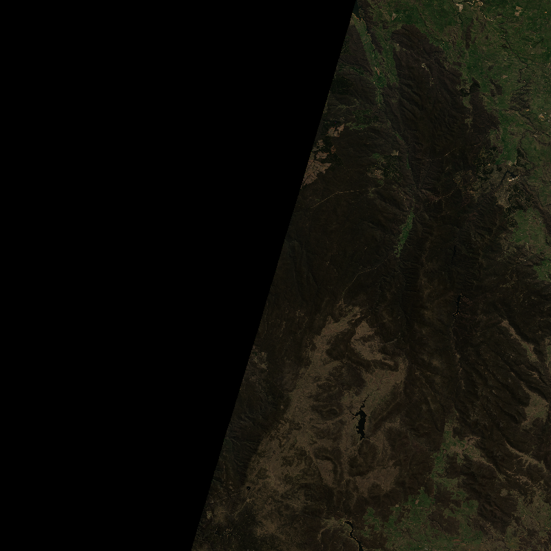
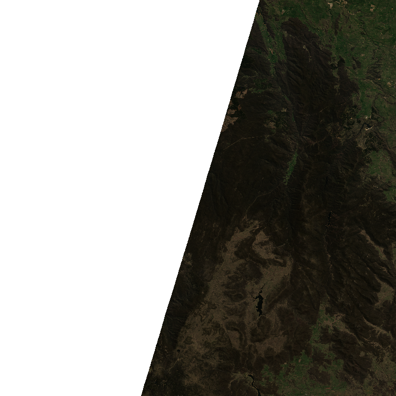
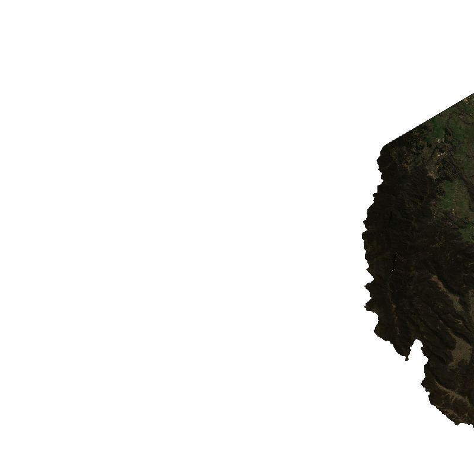
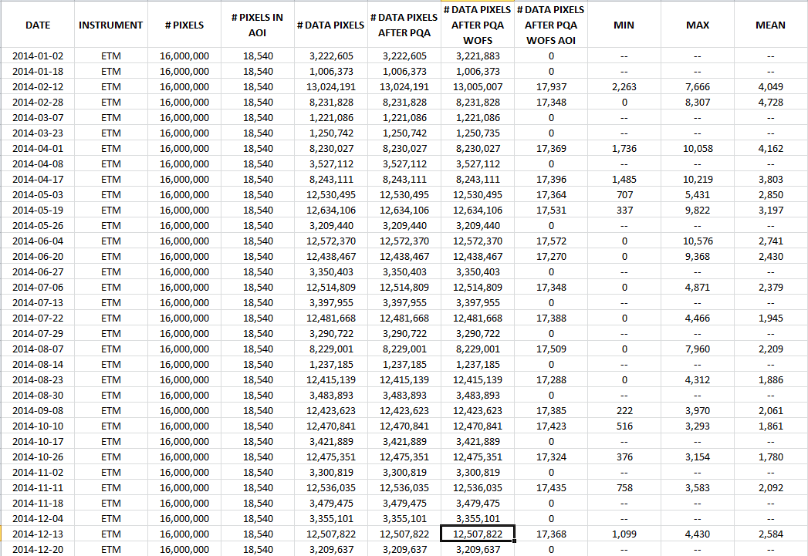
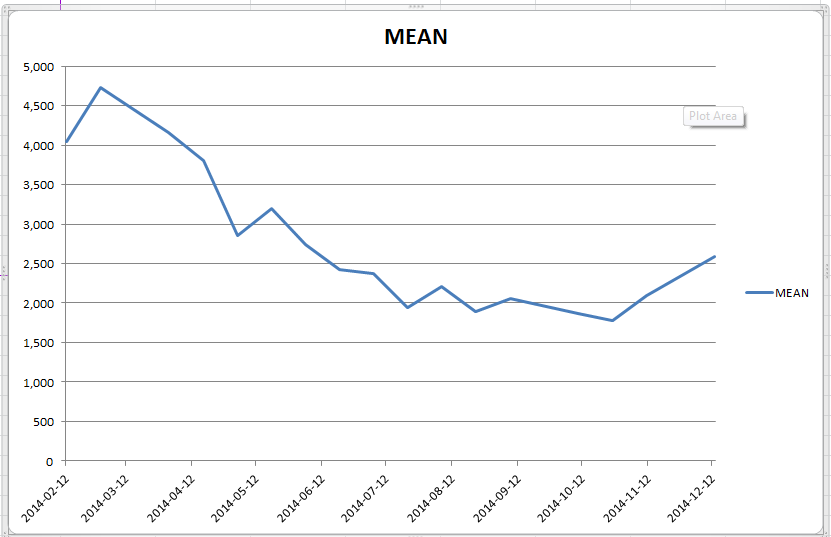

.. toctree::
   :maxdepth: 2

API Command Line Tools
======================

There are also a set of “tools” – i.e. packaged executables – aimed at the NPP (Non-Python “People”):

* Retrieve pixel time series
* Retrieve dataset
* Retrieve dataset time series
* Retrieve dataset stack
* Retrieve aoi time series
* Summarise dataset time series
* …

Retrieve Pixel Time Series
--------------------------

The *Retrieve Pixel Time Series* tool extracts the values of a given pixel from the specified dataset over time to a
CSV file.  Pixel quality masking can be applied.  Acquisitions that are completely masked can be output or omitted::

    $ retrieve_pixel_time_series.py -h

    usage: retrieve_pixel_time_series.py

           [-h]
           [--quiet | --verbose]
           [--acq-min ACQ_MIN] [--acq-max ACQ_MAX]
           [--satellite LS5 LS7 LS8 [LS5 LS7 LS8 ...]]
           [--mask-pqa-apply]
           [--mask-pqa-mask PQ_MASK_SATURATION_THERMAL PQ_MASK_SATURATION_OPTICAL PQ_MASK_SATURATION PQ_MASK_CONTIGUITY PQ_MASK_LAND PQ_MASK_CLOUD_ACCA PQ_MASK_CLOUD_FMASK PQ_MASK_CLOUD_SHADOW_ACCA PQ_MASK_CLOUD_SHADOW_FMASK PQ_MASK_CLOUD PQ_MASK_CLEAR [PQ_MASK_SATURATION_THERMAL PQ_MASK_SATURATION_OPTICAL PQ_MASK_SATURATION PQ_MASK_CONTIGUITY PQ_MASK_LAND PQ_MASK_CLOUD_ACCA PQ_MASK_CLOUD_FMASK PQ_MASK_CLOUD_SHADOW_ACCA PQ_MASK_CLOUD_SHADOW_FMASK PQ_MASK_CLOUD PQ_MASK_CLEAR ...]]
           [--mask-wofs-apply]
           [--mask-wofs-mask DRY NO_DATA SATURATION_CONTIGUITY SEA_WATER TERRAIN_SHADOW HIGH_SLOPE CLOUD_SHADOW CLOUD WET [DRY NO_DATA SATURATION_CONTIGUITY SEA_WATER TERRAIN_SHADOW HIGH_SLOPE CLOUD_SHADOW CLOUD WET ...]]
           --lat LATITUDE --lon LONGITUDE
           [--hide-no-data]
           --dataset-type ARG25 PQ25 FC25 WATER DSM DEM DEM_HYDROLOGICALLY_ENFORCED DEM_SMOOTHED NDVI EVI NBR TCI
           [--bands-all | --bands-common]
           [--delimiter DELIMITER]
           [--output-directory OUTPUT_DIRECTORY]
           [--overwrite]

    Retrieve Pixel Time Series

    optional arguments:
      -h, --help            show this help message and exit
      --quiet               Less output
      --verbose             More output
      --acq-min ACQ_MIN     Acquisition Date
      --acq-max ACQ_MAX     Acquisition Date
      --satellite LS5 LS7 LS8 [LS5 LS7 LS8 ...]
                            The satellite(s) to include
      --mask-pqa-apply      Apply PQA mask
      --mask-pqa-mask PQ_MASK_SATURATION_THERMAL PQ_MASK_SATURATION_OPTICAL PQ_MASK_SATURATION PQ_MASK_CONTIGUITY PQ_MASK_LAND PQ_MASK_CLOUD_ACCA PQ_MASK_CLOUD_FMASK PQ_MASK_CLOUD_SHADOW_ACCA PQ_MASK_CLOUD_SHADOW_FMASK PQ_MASK_CLOUD PQ_MASK_CLEAR [PQ_MASK_SATURATION_THERMAL PQ_MASK_SATURATION_OPTICAL PQ_MASK_SATURATION PQ_MASK_CONTIGUITY PQ_MASK_LAND PQ_MASK_CLOUD_ACCA PQ_MASK_CLOUD_FMASK PQ_MASK_CLOUD_SHADOW_ACCA PQ_MASK_CLOUD_SHADOW_FMASK PQ_MASK_CLOUD PQ_MASK_CLEAR ...]
                            The PQA mask to apply
      --mask-wofs-apply     Apply WOFS mask
      --mask-wofs-mask DRY NO_DATA SATURATION_CONTIGUITY SEA_WATER TERRAIN_SHADOW HIGH_SLOPE CLOUD_SHADOW CLOUD WET [DRY NO_DATA SATURATION_CONTIGUITY SEA_WATER TERRAIN_SHADOW HIGH_SLOPE CLOUD_SHADOW CLOUD WET ...]
                            The WOFS mask to apply
      --lat LATITUDE        Latitude value of pixel
      --lon LONGITUDE       Longitude value of pixel
      --hide-no-data        Don't output records that are completely no data value(s)
      --dataset-type ARG25 PQ25 FC25 WATER DSM DEM DEM_HYDROLOGICALLY_ENFORCED DEM_SMOOTHED NDVI EVI NBR TCI
                            The type of dataset from which values will be retrieved
      --bands-all           Retrieve all bands with NULL values where the band is N/A
      --bands-common        Retrieve only bands in common across all satellites
      --delimiter DELIMITER
                            Field delimiter in output file
      --output-directory OUTPUT_DIRECTORY
                            Output directory
      --overwrite           Over write existing output file

.. NOTE::

    The ACQ DATE parameters support dates being specified as ``YYYY`` or ``YYYY-MM`` or ``YYYY-MM-DD``.

    The MIN parameter maps the value down - i.e. `2000` -> `2000-01-01` and `2000-12` -> `2012-12-01`

    The MAX parameter maps the value up - i.e. `2000` -> `2000-12-31` and `2000-01` -> `2012-01-31`

Example Uses
++++++++++++

For example to retrieve the NBAR values::

    $ retrieve_pixel_time_series.py --lon 120.25 --lat -20.25 --acq-min 2013-12 --acq-max 2013-12 --satellite LS7 --dataset-type ARG25 --quiet

    SATELLITE,ACQUISITION DATE,BLUE,GREEN,RED,NEAR_INFRARED,SHORT_WAVE_INFRARED_1,SHORT_WAVE_INFRARED_2
    LS7,2013-12-01 01:58:47,-999,-999,-999,-999,-999,-999
    LS7,2013-12-10 01:53:02,-999,-999,-999,-999,-999,-999
    LS7,2013-12-17 01:58:47,388,824,1605,2632,3326,2626
    LS7,2013-12-26 01:53:05,-999,-999,-999,-999,-999,-999

and again applying pixel quality masking (defaults to selecting CLEAR pixels but can be changed via the ``--mask-pqa-mask`` argument)::

    $ retrieve_pixel_time_series.py --lon 120.25 --lat -20.25 --acq-min 2013-12 --acq-max 2013-12 --satellite LS7 --dataset-type ARG25 --quiet --mask-pqa-apply

    SATELLITE,ACQUISITION DATE,BLUE,GREEN,RED,NEAR_INFRARED,SHORT_WAVE_INFRARED_1,SHORT_WAVE_INFRARED_2
    LS7,2013-12-01 01:58:47,-999,-999,-999,-999,-999,-999
    LS7,2013-12-10 01:53:02,-999,-999,-999,-999,-999,-999
    LS7,2013-12-17 01:58:47,388,824,1605,2632,3326,2626
    LS7,2013-12-26 01:53:05,-999,-999,-999,-999,-999,-999

and again omitting no data values::

    $ retrieve_pixel_time_series.py --lon 120.25 --lat -20.25 --acq-min 2013-12 --acq-max 2013-12 --satellite LS7 --dataset-type ARG25 --quiet --mask-pqa-apply --hide-no-data

    SATELLITE,ACQUISITION DATE,BLUE,GREEN,RED,NEAR_INFRARED,SHORT_WAVE_INFRARED_1,SHORT_WAVE_INFRARED_2
    LS7,2013-12-17 01:58:47,388,824,1605,2632,3326,2626

and mixing and matching Landsat 5, 7 and 8 (i.e. data sets that have different band combinations)::

    $ retrieve_pixel_time_series.py --lon 120.25 --lat -20.25 --acq-min 2013-12 --acq-max 2013-12 --satellite LS7 --dataset-type ARG25 --quiet --mask-pqa-apply --hide-no-data --satellite LS7 LS8

    SATELLITE,ACQUISITION DATE,BLUE,GREEN,RED,NEAR_INFRARED,SHORT_WAVE_INFRARED_1,SHORT_WAVE_INFRARED_2,COASTAL_AEROSOL
    LS8,2013-12-02 01:57:55,507,871,1630,2633,3236,2513,493
    LS8,2013-12-09 02:04:05,448,820,1592,2596,3260,2550,430
    LS7,2013-12-17 01:58:47,388,824,1605,2632,3326,2626,
    LS8,2013-12-18 01:57:47,496,847,1605,2638,3252,2509,485

which outputs an **empty** value where the band is not applicable; or to only include the bands common across all satellites::

    $ retrieve_pixel_time_series.py --lon 120.25 --lat -20.25 --acq-min 2013-12 --acq-max 2013-12 --satellite LS7 --dataset-type ARG25 --quiet --mask-pqa-apply --hide-no-data --satellite LS7 LS8 --bands-common

    SATELLITE,ACQUISITION DATE,BLUE,GREEN,RED,NEAR_INFRARED,SHORT_WAVE_INFRARED_1,SHORT_WAVE_INFRARED_2
    LS8,2013-12-02 01:57:55,507,871,1630,2633,3236,2513
    LS8,2013-12-09 02:04:05,448,820,1592,2596,3260,2550
    LS7,2013-12-17 01:58:47,388,824,1605,2632,3326,2626
    LS8,2013-12-18 01:57:47,496,847,1605,2638,3252,2509

To retrieve WOFS water extent values for a pixel::

    $ retrieve_pixel_time_series.py --lon 120.25 --lat -20.25 --acq-min 2013-12 --acq-max 2013-12 --satellite LS7 --dataset-type WATER --quiet

    SATELLITE,ACQUISITION DATE,WATER
    LS7,2013-12-01 01:58:47,Saturation/Contiguity,2
    LS7,2013-12-10 01:53:02,Saturation/Contiguity,2
    LS7,2013-12-17 01:58:47,Dry,0
    LS7,2013-12-26 01:53:05,Saturation/Contiguity,2

Retrieving a "batch" of pixel time series...
%%%%%%%%%%%%%%%%%%%%%%%%%%%%%%%%%%%%%%%%%%%%

If you have a "batch" of pixels each of which you would like to retrieve a time series for, this can be scripted something like...

Create a text file containing the pixel locations (in this instance as lat/lon pairs separated by white space)

.. code-block:: text
    :caption: pixels.txt

    -20.00  120.00
    -21.25  121.25
    -22.50  122.50

Run a little (bash) while loop to retrieve the values to files...

.. code-block:: bash

    $ while read lat lon; do echo "Retrieving time series for $lon / $lat" ; retrieve_pixel_time_series.py --lon $lon --lat $lat --acq-min 2013-12 --acq-max 2013-12 --satellite LS7 --dataset-type ARG25 --quiet --output-directory $PWD ; done <pixels.txt

    Retrieving time series for 120.00 / -20.00
    Retrieving time series for 121.25 / -21.25
    Retrieving time series for 122.50 / -22.50

and then you should have the following output files...

.. code-block:: bash

    $ ls -l

    -rw-r----- 1 sjo547 v10  345 Jan 20 13:11 LS7_NBAR_120.00000_-20.00000_2013-12-01_2013-12-31.csv
    -rw-r----- 1 sjo547 v10  221 Jan 20 13:11 LS7_NBAR_121.25000_-21.25000_2013-12-01_2013-12-31.csv
    -rw-r----- 1 sjo547 v10  221 Jan 20 13:11 LS7_NBAR_122.50000_-22.50000_2013-12-01_2013-12-31.csv

VERY Rudimentary Pixel Change Detection Using WOFS Water Extents...
%%%%%%%%%%%%%%%%%%%%%%%%%%%%%%%%%%%%%%%%%%%%%%%%%%%%%%%%%%%%%%%%%%%

A **VERY** basic form of change detection for a pixel can be done quite simply with the outputs from the the pixel drill by:

#. Executing the pixel drill for your chosen pixel
#. Filter the list back to only WATER and NON WATER observations
#. Filter the list back to only changes from WATER to NON WATER and vice versa

For example to get the change history for the ``150.07994`` / ``-36.36939`` pixel...

.. code-block:: bash

    $ retrieve_pixel_time_series.py --lon 150.07994 --lat -36.36939 --acq-min 1987 --acq-max 2015 --satellite LS5 LS7 --dataset-type WATER --quiet --output-directory $PWD

Then to filter back to only WATER and NON WATER observations...

.. code-block:: bash

    $ grep -e 'Wet\|Dry' LS_WOFS_150.07994_-36.36939_1987-01-01_2015-12-31.csv | sort -u -t ',' -k 2,2 >LS_WOFS_150.07994_-36.36939_1987-01-01_2015-12-31.filtered.sorted.csv

This drops back from the initial 940 observations to 215 observations.

Then to filter back to only observations that indication a change...

.. code-block:: bash

    $ IFS="," ; unset pclass ; while read sat acq class iclass; do if [ -z "$pclass" ] || [ "$class" != "$pclass" ]; then echo "$acq,$pclass,$class"; pclass="$class" ; fi; done <LS_WOFS_150.07994_-36.36939_1987-01-01_2015-12-31.filtered.sorted.csv >LS_WOFS_150.07994_-36.36939_1987-01-01_2015-12-31.changes.csv

This filters back to 19 "change" observations.

This can be imported into Excel, for example, and a couple of calculated cells added and so on...

+----------+----+----+------------+--------------+-------------+
|   DATE   |FROM| TO |DAYS BETWEEN|MONTHS BETWEEN|YEARS BETWEEN|
+==========+====+====+============+==============+=============+
|1988-02-25|    | Dry|            |              |             |
+----------+----+----+------------+--------------+-------------+
|1988-09-29| Dry| Wet|         217|             7|            1|
+----------+----+----+------------+--------------+-------------+
|1998-01-19| Wet| Dry|       3,399|           113|            9|
+----------+----+----+------------+--------------+-------------+
|2002-03-27| Dry| Wet|       1,528|            51|            4|
+----------+----+----+------------+--------------+-------------+
|2002-04-05| Wet| Dry|           9|             0|            0|
+----------+----+----+------------+--------------+-------------+
|2002-09-19| Dry| Wet|         167|             6|            0|
+----------+----+----+------------+--------------+-------------+
|2002-10-05| Wet| Dry|          16|             1|            0|
+----------+----+----+------------+--------------+-------------+
|2005-10-05| Dry| Wet|       1,096|            37|            3|
+----------+----+----+------------+--------------+-------------+
|2005-10-06| Wet| Dry|           1|             0|            0|
+----------+----+----+------------+--------------+-------------+
|2010-03-17| Dry| Wet|       1,623|            54|            4|
+----------+----+----+------------+--------------+-------------+
|2010-04-19| Wet| Dry|          33|             1|            0|
+----------+----+----+------------+--------------+-------------+
|2010-08-24| Dry| Wet|         127|             4|            0|
+----------+----+----+------------+--------------+-------------+
|2011-09-20| Wet| Dry|         392|            13|            1|
+----------+----+----+------------+--------------+-------------+
|2011-09-21| Dry| Wet|           1|             0|            0|
+----------+----+----+------------+--------------+-------------+
|2013-01-04| Wet| Dry|         471|            16|            1|
+----------+----+----+------------+--------------+-------------+
|2013-01-20| Dry| Wet|          16|             1|            0|
+----------+----+----+------------+--------------+-------------+
|2013-09-10| Wet| Dry|         233|             8|            1|
+----------+----+----+------------+--------------+-------------+
|2013-11-13| Dry| Wet|          64|             2|            0|
+----------+----+----+------------+--------------+-------------+
|2014-02-24| Wet| Dry|         103|             3|            0|
+----------+----+----+------------+--------------+-------------+

Retrieve Dataset
----------------

The *Retrieve Dataset* tool retrieves the given dataset(s) optionally applying pixel quality masks.  It can retrieve both
"physical" - NBAR, FC, PQA - and virtual/derived/calculated - NDVI, EVI, NBR, TCI - datasets::

    $ retrieve_dataset.py -h

    usage: retrieve_dataset.py

           [-h]
           [--quiet | --verbose]
           [--acq-min ACQ_MIN] [--acq-max ACQ_MAX]
           [--satellite LS5 LS7 LS8 [LS5 LS7 LS8 ...]]
           [--mask-pqa-apply]
           [--mask-pqa-mask PQ_MASK_SATURATION_THERMAL PQ_MASK_SATURATION_OPTICAL PQ_MASK_SATURATION PQ_MASK_CONTIGUITY PQ_MASK_LAND PQ_MASK_CLOUD_ACCA PQ_MASK_CLOUD_FMASK PQ_MASK_CLOUD_SHADOW_ACCA PQ_MASK_CLOUD_SHADOW_FMASK PQ_MASK_CLOUD PQ_MASK_CLEAR [PQ_MASK_SATURATION_THERMAL PQ_MASK_SATURATION_OPTICAL PQ_MASK_SATURATION PQ_MASK_CONTIGUITY PQ_MASK_LAND PQ_MASK_CLOUD_ACCA PQ_MASK_CLOUD_FMASK PQ_MASK_CLOUD_SHADOW_ACCA PQ_MASK_CLOUD_SHADOW_FMASK PQ_MASK_CLOUD PQ_MASK_CLEAR ...]]
           [--mask-wofs-apply]
           [--mask-wofs-mask DRY NO_DATA SATURATION_CONTIGUITY SEA_WATER TERRAIN_SHADOW HIGH_SLOPE CLOUD_SHADOW CLOUD WET [DRY NO_DATA SATURATION_CONTIGUITY SEA_WATER TERRAIN_SHADOW HIGH_SLOPE CLOUD_SHADOW CLOUD WET ...]]
           [--mask-vector-apply]
           [--mask-vector-file MASK_VECTOR_FILE]
           [--mask-vector-layer MASK_VECTOR_LAYER]
           [--mask-vector-feature MASK_VECTOR_FEATURE]
           --x [110 - 155] --y [-45 - -10]
           --dataset-type ARG25 PQ25 FC25 WATER DSM DEM DEM_HYDROLOGICALLY_ENFORCED DEM_SMOOTHED NDVI EVI NBR TCI [ARG25 PQ25 FC25 WATER DSM DEM DEM_HYDROLOGICALLY_ENFORCED DEM_SMOOTHED NDVI EVI NBR TCI ...]
           --output-directory OUTPUT_DIRECTORY
           [--overwrite]
           [--list-only]
           [--output-format GEOTIFF ENVI]

    Retrieve Dataset

    optional arguments:
      -h, --help            show this help message and exit
      --quiet               Less output
      --verbose             More output
      --acq-min ACQ_MIN     Acquisition Date
      --acq-max ACQ_MAX     Acquisition Date
      --satellite LS5 LS7 LS8 [LS5 LS7 LS8 ...]
                            The satellite(s) to include
      --mask-pqa-apply      Apply PQA mask
      --mask-pqa-mask PQ_MASK_SATURATION_THERMAL PQ_MASK_SATURATION_OPTICAL PQ_MASK_SATURATION PQ_MASK_CONTIGUITY PQ_MASK_LAND PQ_MASK_CLOUD_ACCA PQ_MASK_CLOUD_FMASK PQ_MASK_CLOUD_SHADOW_ACCA PQ_MASK_CLOUD_SHADOW_FMASK PQ_MASK_CLOUD PQ_MASK_CLEAR [PQ_MASK_SATURATION_THERMAL PQ_MASK_SATURATION_OPTICAL PQ_MASK_SATURATION PQ_MASK_CONTIGUITY PQ_MASK_LAND PQ_MASK_CLOUD_ACCA PQ_MASK_CLOUD_FMASK PQ_MASK_CLOUD_SHADOW_ACCA PQ_MASK_CLOUD_SHADOW_FMASK PQ_MASK_CLOUD PQ_MASK_CLEAR ...]
                            The PQA mask to apply
      --mask-wofs-apply     Apply WOFS mask
      --mask-wofs-mask DRY NO_DATA SATURATION_CONTIGUITY SEA_WATER TERRAIN_SHADOW HIGH_SLOPE CLOUD_SHADOW CLOUD WET [DRY NO_DATA SATURATION_CONTIGUITY SEA_WATER TERRAIN_SHADOW HIGH_SLOPE CLOUD_SHADOW CLOUD WET ...]
                            The WOFS mask to apply
      --mask-vector-apply   Apply mask from feature in vector file
      --mask-vector-file MASK_VECTOR_FILE
                            The vector file containing the mask
      --mask-vector-layer MASK_VECTOR_LAYER
                            The (index of) the layer containing the mask
      --mask-vector-feature MASK_VECTOR_FEATURE
                            The (index of) the feature containing the mask
      --x [110 - 155]       X grid reference
      --y [-45 - -10]       Y grid reference
      --dataset-type ARG25 PQ25 FC25 WATER DSM DEM DEM_HYDROLOGICALLY_ENFORCED DEM_SMOOTHED NDVI EVI NBR TCI [ARG25 PQ25 FC25 WATER DSM DEM DEM_HYDROLOGICALLY_ENFORCED DEM_SMOOTHED NDVI EVI NBR TCI ...]
                            The type(s) of dataset to retrieve
      --output-directory OUTPUT_DIRECTORY
                            Output directory
      --overwrite           Over write existing output file
      --list-only           List the datasets that would be retrieved rather than retrieving them
      --output-format GEOTIFF ENVI
                            The format of the output dataset

.. NOTE::

    The ACQ DATE parameters support dates being specified as ``YYYY`` or ``YYYY-MM`` or ``YYYY-MM-DD``.

    The MIN parameter maps the value down - i.e. `2000` -> `2000-01-01` and `2000-12` -> `2012-12-01`

    The MAX parameter maps the value up - i.e. `2000` -> `2000-12-31` and `2000-01` -> `2012-01-31`

Example Uses
++++++++++++

For example to find out what LS8 datasets we have from December 2013 for the 120/-25 cell::

    $ retrieve_dataset.py --x 120 --y -20 --satellite LS8 --acq-min 2013-12 --acq-max 2013-12 --dataset-type ARG25 --list-only --output-directory /tmp

    2015-04-29 10:13:49,448 INFO
            acq = 2013-12-01 to 2013-12-31
            satellites = LS8
            PQA mask =
            WOFS mask =

    2015-04-29 10:13:49,448 INFO
            x = 120
            y = -020

    2015-04-29 10:13:49,448 INFO
            datasets to retrieve = ARG25
            output directory = /tmp
            over write existing = False
            list only = True

    2015-04-29 10:13:50,187 INFO Would retrieve datasets [/g/data/rs0/tiles/EPSG4326_1deg_0.00025pixel/LS8_OLI_TIRS/120_-020/2013/mosaic_cache/LS8_OLI_TIRS_NBAR_120_-020_2013-12-02T01-57-07.vrt]
    2015-04-29 10:13:50,188 INFO Would retrieve datasets [/g/data/rs0/tiles/EPSG4326_1deg_0.00025pixel/LS8_OLI_TIRS/120_-020/2013/LS8_OLI_TIRS_NBAR_120_-020_2013-12-09T02-03-41.tif]
    2015-04-29 10:13:50,188 INFO Would retrieve datasets [/g/data/rs0/tiles/EPSG4326_1deg_0.00025pixel/LS8_OLI_TIRS/120_-020/2013/mosaic_cache/LS8_OLI_TIRS_NBAR_120_-020_2013-12-18T01-56-59.vrt]

To retrieve the NBAR and FC datasets apply PQ mask (saturation and contiguity only)::

    $ retrieve_dataset.py --x 120 --y -20 --satellite LS8 --acq-min 2013-12 --acq-max 2013-12 --dataset-type ARG25 FC25 --mask-pqa-apply --mask-pqa-mask PQ_MASK_SATURATION PQ_MASK_CONTIGUITY --output-directory /tmp

    2015-04-29 11:07:59,063 INFO
            acq = 2013-12-01 to 2013-12-31
            satellites = LS8
            PQA mask = PQ_MASK_SATURATION PQ_MASK_CONTIGUITY
            WOFS mask =

    2015-04-29 11:07:59,063 INFO
            x = 120
            y = -020

    2015-04-29 11:07:59,063 INFO
            datasets to retrieve = ARG25 FC25
            output directory = /tmp
            over write existing = False
            list only = False

    2015-04-29 11:07:59,257 INFO Retrieving data from [/g/data/rs0/tiles/EPSG4326_1deg_0.00025pixel/LS8_OLI_TIRS/120_-020/2013/mosaic_cache/LS8_OLI_TIRS_NBAR_120_-020_2013-12-02T01-57-07.vrt] with pq [/g/data/rs0/tiles/EPSG4326_1deg_0.00025pixel/LS8_OLI_TIRS/120_-020/2013/mosaic_cache/LS8_OLI_TIRS_PQA_120_-020_2013-12-02T01-57-07.tif] and pq mask [[<PqaMask.PQ_MASK_SATURATION: 255>, <PqaMask.PQ_MASK_CONTIGUITY: 256>]] and wofs [] and wofs mask [] to [/g/data/u46/sjo/testing/0.1.0-b20150428/LS8_OLI_TIRS_NBAR_WITH_PQA_120_-020_2013-12-02T01-57-07.tif]
    2015-04-29 11:08:37,438 INFO Retrieving data from [/g/data/rs0/tiles/EPSG4326_1deg_0.00025pixel/LS8_OLI_TIRS/120_-020/2013/mosaic_cache/LS8_OLI_TIRS_FC_120_-020_2013-12-02T01-57-07.vrt] with pq [/g/data/rs0/tiles/EPSG4326_1deg_0.00025pixel/LS8_OLI_TIRS/120_-020/2013/mosaic_cache/LS8_OLI_TIRS_PQA_120_-020_2013-12-02T01-57-07.tif] and pq mask [[<PqaMask.PQ_MASK_SATURATION: 255>, <PqaMask.PQ_MASK_CONTIGUITY: 256>]] and wofs [] and wofs mask [] to [/g/data/u46/sjo/testing/0.1.0-b20150428/LS8_OLI_TIRS_FC_WITH_PQA_120_-020_2013-12-02T01-57-07.tif]

    2015-04-29 11:08:53,955 INFO Retrieving data from [/g/data/rs0/tiles/EPSG4326_1deg_0.00025pixel/LS8_OLI_TIRS/120_-020/2013/LS8_OLI_TIRS_NBAR_120_-020_2013-12-09T02-03-41.tif] with pq [/g/data/rs0/tiles/EPSG4326_1deg_0.00025pixel/LS8_OLI_TIRS/120_-020/2013/LS8_OLI_TIRS_PQA_120_-020_2013-12-09T02-03-41.tif] and pq mask [[<PqaMask.PQ_MASK_SATURATION: 255>, <PqaMask.PQ_MASK_CONTIGUITY: 256>]] and wofs [] and wofs mask [] to [/g/data/u46/sjo/testing/0.1.0-b20150428/LS8_OLI_TIRS_NBAR_WITH_PQA_120_-020_2013-12-09T02-03-41.tif]
    2015-04-29 11:09:15,763 INFO Retrieving data from [/g/data/rs0/tiles/EPSG4326_1deg_0.00025pixel/LS8_OLI_TIRS/120_-020/2013/LS8_OLI_TIRS_FC_120_-020_2013-12-09T02-03-41.tif] with pq [/g/data/rs0/tiles/EPSG4326_1deg_0.00025pixel/LS8_OLI_TIRS/120_-020/2013/LS8_OLI_TIRS_PQA_120_-020_2013-12-09T02-03-41.tif] and pq mask [[<PqaMask.PQ_MASK_SATURATION: 255>, <PqaMask.PQ_MASK_CONTIGUITY: 256>]] and wofs [] and wofs mask [] to [/g/data/u46/sjo/testing/0.1.0-b20150428/LS8_OLI_TIRS_FC_WITH_PQA_120_-020_2013-12-09T02-03-41.tif]

    2015-04-29 11:09:27,515 INFO Retrieving data from [/g/data/rs0/tiles/EPSG4326_1deg_0.00025pixel/LS8_OLI_TIRS/120_-020/2013/mosaic_cache/LS8_OLI_TIRS_NBAR_120_-020_2013-12-18T01-56-59.vrt] with pq [/g/data/rs0/tiles/EPSG4326_1deg_0.00025pixel/LS8_OLI_TIRS/120_-020/2013/mosaic_cache/LS8_OLI_TIRS_PQA_120_-020_2013-12-18T01-56-59.tif] and pq mask [[<PqaMask.PQ_MASK_SATURATION: 255>, <PqaMask.PQ_MASK_CONTIGUITY: 256>]] and wofs [] and wofs mask [] to [/g/data/u46/sjo/testing/0.1.0-b20150428/LS8_OLI_TIRS_NBAR_WITH_PQA_120_-020_2013-12-18T01-56-59.tif]
    2015-04-29 11:10:00,857 INFO Retrieving data from [/g/data/rs0/tiles/EPSG4326_1deg_0.00025pixel/LS8_OLI_TIRS/120_-020/2013/mosaic_cache/LS8_OLI_TIRS_FC_120_-020_2013-12-18T01-56-59.vrt] with pq [/g/data/rs0/tiles/EPSG4326_1deg_0.00025pixel/LS8_OLI_TIRS/120_-020/2013/mosaic_cache/LS8_OLI_TIRS_PQA_120_-020_2013-12-18T01-56-59.tif] and pq mask [[<PqaMask.PQ_MASK_SATURATION: 255>, <PqaMask.PQ_MASK_CONTIGUITY: 256>]] and wofs [] and wofs mask [] to [/g/data/u46/sjo/testing/0.1.0-b20150428/LS8_OLI_TIRS_FC_WITH_PQA_120_-020_2013-12-18T01-56-59.tif]

.. code-block:: text
    :caption: NBAR and FC outputs

    $ ls -lh

    -rw-r----- 1 sjo547 u46 214M Apr 29 10:28 LS8_OLI_TIRS_NBAR_WITH_PQA_120_-020_2013-12-02T01-57-07.tif
    -rw-r----- 1 sjo547 u46 123M Apr 29 10:28 LS8_OLI_TIRS_FC_WITH_PQA_120_-020_2013-12-02T01-57-07.tif

    -rw-r----- 1 sjo547 u46 214M Apr 29 10:28 LS8_OLI_TIRS_NBAR_WITH_PQA_120_-020_2013-12-09T02-03-41.tif
    -rw-r----- 1 sjo547 u46 123M Apr 29 10:29 LS8_OLI_TIRS_FC_WITH_PQA_120_-020_2013-12-09T02-03-41.tif

    -rw-r----- 1 sjo547 u46 123M Apr 29 10:30 LS8_OLI_TIRS_FC_WITH_PQA_120_-020_2013-12-18T01-56-59.tif
    -rw-r----- 1 sjo547 u46 214M Apr 29 10:29 LS8_OLI_TIRS_NBAR_WITH_PQA_120_-020_2013-12-18T01-56-59.tif

.. code-block:: text
    :caption: `LS8_OLI_TIRS_FC_WITH_PQA_120_-020_2013-12-02T01-57-07.tif`...

    $ gdalinfo LS8_OLI_TIRS_FC_WITH_PQA_120_-020_2013-12-02T01-57-07.tif

    Driver: GTiff/GeoTIFF
    Files: LS8_OLI_TIRS_FC_WITH_PQA_120_-020_2013-12-02T01-57-07.tif
    Size is 4000, 4000
    ...
    Origin = (120.000000000000000,-19.000000000000000)
    Pixel Size = (0.000250000000000,-0.000250000000000)
    ...
    Metadata:
      ACQUISITION_DATE=2013-12-02 01:57:31
      AREA_OR_POINT=Area
      DATASET_TYPE=FC25
      PIXEL_QUALITY_FILTER=PQ_MASK_SATURATION PQ_MASK_CONTIGUITY
      SATELLITE=LS8
      X_INDEX=120
      Y_INDEX=-020
    ...
    Band 1 Block=4000x1 Type=Int16, ColorInterp=Gray
      Description = PHOTOSYNTHETIC_VEGETATION
      Minimum=0.000, Maximum=16959.000, Mean=6743.956, StdDev=6415.091
      NoData Value=-999
    ...
    Band 2 Block=4000x1 Type=Int16, ColorInterp=Undefined
      Description = NON_PHOTOSYNTHETIC_VEGETATION
      Minimum=0.000, Maximum=21059.000, Mean=10392.389, StdDev=4577.513
      NoData Value=-999
    ...
    Band 3 Block=4000x1 Type=Int16, ColorInterp=Undefined
      Description = BARE_SOIL
      Minimum=0.000, Maximum=16959.000, Mean=5404.868, StdDev=7320.007
      NoData Value=-999
    ...
    Band 4 Block=4000x1 Type=Int16, ColorInterp=Undefined
      Description = UNMIXING_ERROR
      Minimum=326.000, Maximum=16959.000, Mean=7182.122, StdDev=6224.030
      NoData Value=-999

To generate NDVI and NBR datasets from each NBAR dataset after applying PQA::

    $ retrieve_dataset.py --x 120 --y -20 --satellite LS8 --acq-min 2013-12 --acq-max 2013-12 --dataset-type NDVI NBR --mask-pqa-apply --output-directory /tmp

    2015-04-29 11:45:14,860 INFO
            acq = 2013-12-01 to 2013-12-31
            satellites = LS8
            PQA mask = PQ_MASK_CLEAR
            WOFS mask =

    2015-04-29 11:45:14,860 INFO
            x = 120
            y = -020

    2015-04-29 11:45:14,861 INFO
            datasets to retrieve = NDVI NBR
            output directory = /tmp
            over write existing = False
            list only = False

    2015-04-29 11:45:15,474 INFO Retrieving data from [/g/data/rs0/tiles/EPSG4326_1deg_0.00025pixel/LS8_OLI_TIRS/120_-020/2013/mosaic_cache/LS8_OLI_TIRS_NBAR_120_-020_2013-12-02T01-57-07.vrt] with pq [/g/data/rs0/tiles/EPSG4326_1deg_0.00025pixel/LS8_OLI_TIRS/120_-020/2013/mosaic_cache/LS8_OLI_TIRS_PQA_120_-020_2013-12-02T01-57-07.tif] and pq mask [[<PqaMask.PQ_MASK_CLEAR: 16383>]] and wofs [] and wofs mask [] to [/g/data/u46/sjo/testing/0.1.0-b20150428/LS8_OLI_TIRS_NDVI_WITH_PQA_120_-020_2013-12-02T01-57-07.tif]
    2015-04-29 11:45:23,697 INFO Retrieving data from [/g/data/rs0/tiles/EPSG4326_1deg_0.00025pixel/LS8_OLI_TIRS/120_-020/2013/mosaic_cache/LS8_OLI_TIRS_NBAR_120_-020_2013-12-02T01-57-07.vrt] with pq [/g/data/rs0/tiles/EPSG4326_1deg_0.00025pixel/LS8_OLI_TIRS/120_-020/2013/mosaic_cache/LS8_OLI_TIRS_PQA_120_-020_2013-12-02T01-57-07.tif] and pq mask [[<PqaMask.PQ_MASK_CLEAR: 16383>]] and wofs [] and wofs mask [] to [/g/data/u46/sjo/testing/0.1.0-b20150428/LS8_OLI_TIRS_NBR_WITH_PQA_120_-020_2013-12-02T01-57-07.tif]

    2015-04-29 11:45:30,774 INFO Retrieving data from [/g/data/rs0/tiles/EPSG4326_1deg_0.00025pixel/LS8_OLI_TIRS/120_-020/2013/LS8_OLI_TIRS_NBAR_120_-020_2013-12-09T02-03-41.tif] with pq [/g/data/rs0/tiles/EPSG4326_1deg_0.00025pixel/LS8_OLI_TIRS/120_-020/2013/LS8_OLI_TIRS_PQA_120_-020_2013-12-09T02-03-41.tif] and pq mask [[<PqaMask.PQ_MASK_CLEAR: 16383>]] and wofs [] and wofs mask [] to [/g/data/u46/sjo/testing/0.1.0-b20150428/LS8_OLI_TIRS_NDVI_WITH_PQA_120_-020_2013-12-09T02-03-41.tif]
    2015-04-29 11:45:34,722 INFO Retrieving data from [/g/data/rs0/tiles/EPSG4326_1deg_0.00025pixel/LS8_OLI_TIRS/120_-020/2013/LS8_OLI_TIRS_NBAR_120_-020_2013-12-09T02-03-41.tif] with pq [/g/data/rs0/tiles/EPSG4326_1deg_0.00025pixel/LS8_OLI_TIRS/120_-020/2013/LS8_OLI_TIRS_PQA_120_-020_2013-12-09T02-03-41.tif] and pq mask [[<PqaMask.PQ_MASK_CLEAR: 16383>]] and wofs [] and wofs mask [] to [/g/data/u46/sjo/testing/0.1.0-b20150428/LS8_OLI_TIRS_NBR_WITH_PQA_120_-020_2013-12-09T02-03-41.tif]

    2015-04-29 11:45:38,428 INFO Retrieving data from [/g/data/rs0/tiles/EPSG4326_1deg_0.00025pixel/LS8_OLI_TIRS/120_-020/2013/mosaic_cache/LS8_OLI_TIRS_NBAR_120_-020_2013-12-18T01-56-59.vrt] with pq [/g/data/rs0/tiles/EPSG4326_1deg_0.00025pixel/LS8_OLI_TIRS/120_-020/2013/mosaic_cache/LS8_OLI_TIRS_PQA_120_-020_2013-12-18T01-56-59.tif] and pq mask [[<PqaMask.PQ_MASK_CLEAR: 16383>]] and wofs [] and wofs mask [] to [/g/data/u46/sjo/testing/0.1.0-b20150428/LS8_OLI_TIRS_NDVI_WITH_PQA_120_-020_2013-12-18T01-56-59.tif]
    2015-04-29 11:45:45,491 INFO Retrieving data from [/g/data/rs0/tiles/EPSG4326_1deg_0.00025pixel/LS8_OLI_TIRS/120_-020/2013/mosaic_cache/LS8_OLI_TIRS_NBAR_120_-020_2013-12-18T01-56-59.vrt] with pq [/g/data/rs0/tiles/EPSG4326_1deg_0.00025pixel/LS8_OLI_TIRS/120_-020/2013/mosaic_cache/LS8_OLI_TIRS_PQA_120_-020_2013-12-18T01-56-59.tif] and pq mask [[<PqaMask.PQ_MASK_CLEAR: 16383>]] and wofs [] and wofs mask [] to [/g/data/u46/sjo/testing/0.1.0-b20150428/LS8_OLI_TIRS_NBR_WITH_PQA_120_-020_2013-12-18T01-56-59.tif]

.. code-block:: text
    :caption: NDVI and NBR outputs

    $ ls -lh

    -rw-r----- 1 sjo547 u46 62M Apr 29 11:45 LS8_OLI_TIRS_NDVI_WITH_PQA_120_-020_2013-12-02T01-57-07.tif
    -rw-r----- 1 sjo547 u46 62M Apr 29 11:45 LS8_OLI_TIRS_NBR_WITH_PQA_120_-020_2013-12-02T01-57-07.tif

    -rw-r----- 1 sjo547 u46 62M Apr 29 11:45 LS8_OLI_TIRS_NDVI_WITH_PQA_120_-020_2013-12-09T02-03-41.tif
    -rw-r----- 1 sjo547 u46 62M Apr 29 11:45 LS8_OLI_TIRS_NBR_WITH_PQA_120_-020_2013-12-09T02-03-41.tif

    -rw-r----- 1 sjo547 u46 62M Apr 29 11:45 LS8_OLI_TIRS_NBR_WITH_PQA_120_-020_2013-12-18T01-56-59.tif
    -rw-r----- 1 sjo547 u46 62M Apr 29 11:45 LS8_OLI_TIRS_NDVI_WITH_PQA_120_-020_2013-12-18T01-56-59.tif

.. code-block:: text
    :caption: `LS8_OLI_TIRS_NDVI_WITH_PQA_120_-020_2013-12-02T01-57-07.tif`...

    $ gdalinfo LS8_OLI_TIRS_NDVI_WITH_PQA_120_-020_2013-12-02T01-57-07.tif

    Driver: GTiff/GeoTIFF
    Files: LS8_OLI_TIRS_NDVI_WITH_PQA_120_-020_2013-12-02T01-57-07.tif
    Size is 4000, 4000
    ...
    Origin = (120.000000000000000,-19.000000000000000)
    Pixel Size = (0.000250000000000,-0.000250000000000)
    ...
    Metadata:
      ACQUISITION_DATE=2013-12-02 01:57:31
      AREA_OR_POINT=Area
      DATASET_TYPE=NDVI
      PIXEL_QUALITY_FILTER=PQ_MASK_CLEAR
      SATELLITE=LS8
      X_INDEX=120
      Y_INDEX=-020
    ...
    Band 1 Block=4000x1 Type=Float32, ColorInterp=Gray
      Description = NDVI
      Minimum=-0.585, Maximum=100000002004089995264.000, Mean=82418751651744006144.000, StdDev=38066057144637997056.000
      NoData Value=nan

To retrieve the FC datasets applying PQ mask in ENVI format::

    $ retrieve_dataset.py --acq-min 2014-01 --acq-max 2014-01 --satellite LS5 LS7 LS8 --mask-pqa-apply --x 120 --y -25 --dataset-type FC25 --output-directory /tmp --output-format ENVI

    2015-05-04 15:46:04,641 INFO
            acq = 2014-01-01 to 2014-01-31
            satellites = LS5 LS7 LS8
            PQA mask = PQ_MASK_CLEAR
            WOFS mask =

    2015-05-04 15:46:04,641 INFO
            x = 120
            y = -025

    2015-05-04 15:46:04,642 INFO
            datasets to retrieve = FC25
            output directory = /tmp
            over write existing = False
            list only = False
            output format = ENVI

    2015-05-04 15:46:04,863 INFO Retrieving data from [/g/data/rs0/tiles/EPSG4326_1deg_0.00025pixel/LS8_OLI_TIRS/120_-025/2014/mosaic_cache/LS8_OLI_TIRS_FC_120_-025_2014-01-03T01-58-04.vrt] with pq [/g/data/rs0/tiles/EPSG4326_1deg_0.00025pixel/LS8_OLI_TIRS/120_-025/2014/mosaic_cache/LS8_OLI_TIRS_PQA_120_-025_2014-01-03T01-58-04.tif] and pq mask [[<PqaMask.PQ_MASK_CLEAR: 16383>]] and wofs [] and wofs mask [] to [ENVI] file [/tmp/LS8_OLI_TIRS_FC_WITH_PQA_120_-025_2014-01-03T01-58-04.dat]
    2015-05-04 15:46:12,963 INFO Retrieving data from [/g/data/rs0/tiles/EPSG4326_1deg_0.00025pixel/LS7_ETM/120_-025/2014/LS7_ETM_FC_120_-025_2014-01-04T01-47-21.tif] with pq [/g/data/rs0/tiles/EPSG4326_1deg_0.00025pixel/LS7_ETM/120_-025/2014/LS7_ETM_PQA_120_-025_2014-01-04T01-47-21.148399.tif] and pq mask [[<PqaMask.PQ_MASK_CLEAR: 16383>]] and wofs [] and wofs mask [] to [ENVI] file [/tmp/LS7_ETM_FC_WITH_PQA_120_-025_2014-01-04T01-47-21.dat]
    2015-05-04 15:46:15,648 INFO Retrieving data from [/g/data/rs0/tiles/EPSG4326_1deg_0.00025pixel/LS8_OLI_TIRS/120_-025/2014/LS8_OLI_TIRS_FC_120_-025_2014-01-12T01-52-08.tif] with pq [/g/data/rs0/tiles/EPSG4326_1deg_0.00025pixel/LS8_OLI_TIRS/120_-025/2014/LS8_OLI_TIRS_PQA_120_-025_2014-01-12T01-52-08.tif] and pq mask [[<PqaMask.PQ_MASK_CLEAR: 16383>]] and wofs [] and wofs mask [] to [ENVI] file [/tmp/LS8_OLI_TIRS_FC_WITH_PQA_120_-025_2014-01-12T01-52-08.dat]
    2015-05-04 15:46:18,494 INFO Retrieving data from [/g/data/rs0/tiles/EPSG4326_1deg_0.00025pixel/LS8_OLI_TIRS/120_-025/2014/LS8_OLI_TIRS_FC_120_-025_2014-01-19T01-58-14.tif] with pq [/g/data/rs0/tiles/EPSG4326_1deg_0.00025pixel/LS8_OLI_TIRS/120_-025/2014/LS8_OLI_TIRS_PQA_120_-025_2014-01-19T01-58-14.tif] and pq mask [[<PqaMask.PQ_MASK_CLEAR: 16383>]] and wofs [] and wofs mask [] to [ENVI] file [/tmp/LS8_OLI_TIRS_FC_WITH_PQA_120_-025_2014-01-19T01-58-14.dat]

.. code-block:: text
    :caption: FC ENVI outputs

    $ ls -lh

    -rw-r----- 1 sjo547 u46 123M May  4 15:46 LS7_ETM_FC_WITH_PQA_120_-025_2014-01-04T01-47-21.dat
    -rw-r----- 1 sjo547 u46  583 May  4 15:46 LS7_ETM_FC_WITH_PQA_120_-025_2014-01-04T01-47-21.hdr

    -rw-r----- 1 sjo547 u46 123M May  4 15:46 LS8_OLI_TIRS_FC_WITH_PQA_120_-025_2014-01-03T01-58-04.dat
    -rw-r----- 1 sjo547 u46  588 May  4 15:46 LS8_OLI_TIRS_FC_WITH_PQA_120_-025_2014-01-03T01-58-04.hdr

    -rw-r----- 1 sjo547 u46 123M May  4 15:46 LS8_OLI_TIRS_FC_WITH_PQA_120_-025_2014-01-12T01-52-08.dat
    -rw-r----- 1 sjo547 u46  588 May  4 15:46 LS8_OLI_TIRS_FC_WITH_PQA_120_-025_2014-01-12T01-52-08.hdr

    -rw-r----- 1 sjo547 u46 123M May  4 15:46 LS8_OLI_TIRS_FC_WITH_PQA_120_-025_2014-01-19T01-58-14.dat
    -rw-r----- 1 sjo547 u46  588 May  4 15:46 LS8_OLI_TIRS_FC_WITH_PQA_120_-025_2014-01-19T01-58-14.hdr

.. code-block:: text
    :caption: `LS7_ETM_FC_WITH_PQA_120_-025_2014-01-04T01-47-21.dat`...

    $ gdalinfo LS7_ETM_FC_WITH_PQA_120_-025_2014-01-04T01-47-21.dat

    Driver: ENVI/ENVI .hdr Labelled
    Files: LS7_ETM_FC_WITH_PQA_120_-025_2014-01-04T01-47-21.dat
           LS7_ETM_FC_WITH_PQA_120_-025_2014-01-04T01-47-21.hdr
    Size is 4000, 4000
    ...
    Origin = (120.000000000000000,-19.000000000000000)
    Pixel Size = (0.000250000000000,-0.000250000000000)
    ...
    Metadata:
      ACQUISITION_DATE=2014-01-04 01:47:45
      DATASET_TYPE=FC25
      PIXEL_QUALITY_FILTER=PQ_MASK_CLEAR
      SATELLITE=LS7
      X_INDEX=120
      Y_INDEX=-025
      Band_1=PHOTOSYNTHETIC_VEGETATION
      Band_2=NON_PHOTOSYNTHETIC_VEGETATION
      Band_3=BARE_SOIL
      Band_4=UNMIXING_ERROR
    ...
    Band 1 Block=4000x1 Type=Int16, ColorInterp=Gray
      Description = PHOTOSYNTHETIC_VEGETATION
      Minimum=0.000, Maximum=16959.000, Mean=6743.956, StdDev=6415.091
      NoData Value=-999
    ...
    Band 2 Block=4000x1 Type=Int16, ColorInterp=Undefined
      Description = NON_PHOTOSYNTHETIC_VEGETATION
      Minimum=0.000, Maximum=21059.000, Mean=10392.389, StdDev=4577.513
      NoData Value=-999
    ...
    Band 3 Block=4000x1 Type=Int16, ColorInterp=Undefined
      Description = BARE_SOIL
      Minimum=0.000, Maximum=16959.000, Mean=5404.868, StdDev=7320.007
      NoData Value=-999
    ...
    Band 4 Block=4000x1 Type=Int16, ColorInterp=Undefined
      Description = UNMIXING_ERROR
      Minimum=326.000, Maximum=16959.000, Mean=7182.122, StdDev=6224.030
      NoData Value=-999

To retrieve the Landsat 8 *Surface Reflectance* dataset from 11\ :sub:`th` October 2013::

    $ retrieve_dataset.py --acq-min 2013-10-11 --acq-max 2013-10-11 --satellite LS8 --x 148 --y -36 --dataset-type ARG25 --output-directory /tmp             
    2015-05-06 14:17:14,639 INFO 
            acq = 2013-10-11 to 2013-10-11
            satellites = LS8
            PQA mask = 
            WOFS mask = 
            
    2015-05-06 14:17:14,639 INFO 
            x = 148
            y = -036
            VECTOR mask = 
            
    2015-05-06 14:17:14,639 INFO 
            datasets to retrieve = ARG25
            output directory = /tmp
            over write existing = False
            list only = False
            output format = GEOTIFF
            
    2015-05-06 14:17:14,784 INFO Retrieving data from [/g/data/rs0/tiles/EPSG4326_1deg_0.00025pixel/LS8_OLI_TIRS/148_-036/2013/mosaic_cache/LS8_OLI_TIRS_NBAR_148_-036_2013-10-11T23-51-59.vrt] with pq [] and pq mask [] and wofs [] and wofs mask [] to [GEOTIFF] file [/tmp/LS8_OLI_TIRS_NBAR_148_-036_2013-10-11T23-51-59.tif]

    ``LS8_OLI_TIRS_NBAR_148_-036_2013-10-11T23-51-59.tif``

To retrieve the Landsat 8 *Surface Reflectance* dataset from 11\ :sub:`th` October 2013 with Pixel Quality masking applied::

    $ retrieve_dataset.py --acq-min 2013-10-11 --acq-max 2013-10-11 --satellite LS8 --x 148 --y -36 --dataset-type ARG25 --output-directory $PWD --mask-pqa-apply

    2015-05-06 14:38:49,329 INFO
            acq = 2013-10-11 to 2013-10-11
            satellites = LS8
            PQA mask = PQ_MASK_CLEAR
            WOFS mask =

    2015-05-06 14:38:49,330 INFO
            x = 148
            y = -036
            VECTOR mask =

    2015-05-06 14:38:49,330 INFO
            datasets to retrieve = ARG25
            output directory = /tmp
            over write existing = False
            list only = False
            output format = GEOTIFF

    2015-05-06 14:38:49,521 INFO Retrieving data from [/g/data/rs0/tiles/EPSG4326_1deg_0.00025pixel/LS8_OLI_TIRS/148_-036/2013/mosaic_cache/LS8_OLI_TIRS_NBAR_148_-036_2013-10-11T23-51-59.vrt] with pq [/g/data/rs0/tiles/EPSG4326_1deg_0.00025pixel/LS8_OLI_TIRS/148_-036/2013/mosaic_cache/LS8_OLI_TIRS_PQA_148_-036_2013-10-11T23-51-59.tif] and pq mask [[<PqaMask.PQ_MASK_CLEAR: 16383>]] and wofs [] and wofs mask [] to [GEOTIFF] file [/tmp/LS8_OLI_TIRS_NBAR_WITH_PQA_148_-036_2013-10-11T23-51-59.tif]

    ``LS8_OLI_TIRS_NBAR_WITH_PQA_148_-036_2013-10-11T23-51-59.tif``

To retrieve the Landsat 8 *Surface Reflectance* dataset from 11\ :sub:`th` October 2013 with Pixel Quality and an ACT area of interest masking applied::

    $ retrieve_dataset.py --acq-min 2013-10-11 --acq-max 2013-10-11 --satellite LS8 --x 148 --y -36 --dataset-type ARG25 --output-directory /tmp --mask-pqa-apply --mask-vector-apply --mask-vector-file australian_states.shp --mask-vector-layer australian_states --mask-vector-feature 4

    2015-05-06 14:43:32,967 INFO
            acq = 2013-10-11 to 2013-10-11
            satellites = LS8
            PQA mask = PQ_MASK_CLEAR
            WOFS mask =

    2015-05-06 14:43:32,967 INFO
            x = 148
            y = -036
            VECTOR mask = /g/data/u46/sjo/tmp/Mainlands.shp Mainlands 4

    2015-05-06 14:43:32,967 INFO
            datasets to retrieve = ARG25
            output directory = /g/data/u46/sjo/testing/0.1.0
            over write existing = False
            list only = False
            output format = GEOTIFF

    2015-05-06 14:43:33,285 INFO Retrieving data from [/g/data/rs0/tiles/EPSG4326_1deg_0.00025pixel/LS8_OLI_TIRS/148_-036/2013/mosaic_cache/LS8_OLI_TIRS_NBAR_148_-036_2013-10-11T23-51-59.vrt] with pq [/g/data/rs0/tiles/EPSG4326_1deg_0.00025pixel/LS8_OLI_TIRS/148_-036/2013/mosaic_cache/LS8_OLI_TIRS_PQA_148_-036_2013-10-11T23-51-59.tif] and pq mask [[<PqaMask.PQ_MASK_CLEAR: 16383>]] and wofs [] and wofs mask [] to [GEOTIFF] file [/tmp/LS8_OLI_TIRS_NBAR_WITH_PQA_VECTOR_148_-036_2013-10-11T23-51-59.tif]

    ``LS8_OLI_TIRS_NBAR_WITH_PQA_VECTOR_148_-036_2013-10-11T23-51-59.tif``

Retrieve Dataset Stack
----------------------

The *Retrieve Dataset Stack* tool retrieves the given dataset(s), optionally applying pixel quality masks, as a band
stack.

That is, a raster file for each band of the requested dataset where each band represents that band from a given acquisition
forming a time series.

It can retrieve both "physical" - NBAR, FC, PQA - and virtual/derived/calculated - NDVI, EVI, NBR, TCI - datasets::

    $ retrieve_dataset_stack.py -h

    usage: retrieve_dataset_stack.py

           [-h]
           [--quiet | --verbose] [
           --acq-min ACQ_MIN] [--acq-max ACQ_MAX]
           [--satellite LS5 LS7 LS8 [LS5 LS7 LS8 ...]]
           [--mask-pqa-apply]
           [--mask-pqa-mask PQ_MASK_SATURATION_THERMAL PQ_MASK_SATURATION_OPTICAL PQ_MASK_SATURATION PQ_MASK_CONTIGUITY PQ_MASK_LAND PQ_MASK_CLOUD_ACCA PQ_MASK_CLOUD_FMASK PQ_MASK_CLOUD_SHADOW_ACCA PQ_MASK_CLOUD_SHADOW_FMASK PQ_MASK_CLOUD PQ_MASK_CLEAR [PQ_MASK_SATURATION_THERMAL PQ_MASK_SATURATION_OPTICAL PQ_MASK_SATURATION PQ_MASK_CONTIGUITY PQ_MASK_LAND PQ_MASK_CLOUD_ACCA PQ_MASK_CLOUD_FMASK PQ_MASK_CLOUD_SHADOW_ACCA PQ_MASK_CLOUD_SHADOW_FMASK PQ_MASK_CLOUD PQ_MASK_CLEAR ...]]
           [--mask-wofs-apply]
           [--mask-wofs-mask DRY NO_DATA SATURATION_CONTIGUITY SEA_WATER TERRAIN_SHADOW HIGH_SLOPE CLOUD_SHADOW CLOUD WET [DRY NO_DATA SATURATION_CONTIGUITY SEA_WATER TERRAIN_SHADOW HIGH_SLOPE CLOUD_SHADOW CLOUD WET ...]]
           [--mask-vector-apply]
           [--mask-vector-file MASK_VECTOR_FILE]
           [--mask-vector-layer MASK_VECTOR_LAYER]
           [--mask-vector-feature MASK_VECTOR_FEATURE]
           --x [110 - 155] --y [-45 - -10]
           --dataset-type ARG25 PQ25 FC25 WATER DSM DEM DEM_HYDROLOGICALLY_ENFORCED DEM_SMOOTHED NDVI EVI NBR TCI
           [--bands-all | --bands-common]
           --output-directory OUTPUT_DIRECTORY
           [--overwrite]
           [--list-only]
           [--output-format GEOTIFF ENVI]

    Retrieve Dataset Stack

    optional arguments:
      -h, --help            show this help message and exit
      --quiet               Less output
      --verbose             More output
      --acq-min ACQ_MIN     Acquisition Date
      --acq-max ACQ_MAX     Acquisition Date
      --satellite LS5 LS7 LS8 [LS5 LS7 LS8 ...]
                            The satellite(s) to include
      --mask-pqa-apply      Apply PQA mask
      --mask-pqa-mask PQ_MASK_SATURATION_THERMAL PQ_MASK_SATURATION_OPTICAL PQ_MASK_SATURATION PQ_MASK_CONTIGUITY PQ_MASK_LAND PQ_MASK_CLOUD_ACCA PQ_MASK_CLOUD_FMASK PQ_MASK_CLOUD_SHADOW_ACCA PQ_MASK_CLOUD_SHADOW_FMASK PQ_MASK_CLOUD PQ_MASK_CLEAR [PQ_MASK_SATURATION_THERMAL PQ_MASK_SATURATION_OPTICAL PQ_MASK_SATURATION PQ_MASK_CONTIGUITY PQ_MASK_LAND PQ_MASK_CLOUD_ACCA PQ_MASK_CLOUD_FMASK PQ_MASK_CLOUD_SHADOW_ACCA PQ_MASK_CLOUD_SHADOW_FMASK PQ_MASK_CLOUD PQ_MASK_CLEAR ...]
                            The PQA mask to apply
      --mask-wofs-apply     Apply WOFS mask
      --mask-wofs-mask DRY NO_DATA SATURATION_CONTIGUITY SEA_WATER TERRAIN_SHADOW HIGH_SLOPE CLOUD_SHADOW CLOUD WET [DRY NO_DATA SATURATION_CONTIGUITY SEA_WATER TERRAIN_SHADOW HIGH_SLOPE CLOUD_SHADOW CLOUD WET ...]
                            The WOFS mask to apply
      --mask-vector-apply   Apply mask from feature in vector file
      --mask-vector-file MASK_VECTOR_FILE
                            The vector file containing the mask
      --mask-vector-layer MASK_VECTOR_LAYER
                            The (index of) the layer containing the mask
      --mask-vector-feature MASK_VECTOR_FEATURE
                            The (index of) the feature containing the mask
      --x [110 - 155]       X grid reference
      --y [-45 - -10]       Y grid reference
      --dataset-type ARG25 PQ25 FC25 WATER DSM DEM DEM_HYDROLOGICALLY_ENFORCED DEM_SMOOTHED NDVI EVI NBR TCI
                            The type(s) of dataset to retrieve
      --bands-all           Retrieve all bands with NULL values where the band is N/A
      --bands-common        Retrieve only bands in common across all satellites
      --output-directory OUTPUT_DIRECTORY
                            Output directory
      --overwrite           Over write existing output file
      --list-only           List the datasets that would be retrieved rather than retrieving them
      --output-format GEOTIFF ENVI
                            The format of the output dataset

.. NOTE::

    The ACQ DATE parameters support dates being specified as ``YYYY`` or ``YYYY-MM`` or ``YYYY-MM-DD``.

    The MIN parameter maps the value down - i.e. `2000` -> `2000-01-01` and `2000-12` -> `2012-12-01`

    The MAX parameter maps the value up - i.e. `2000` -> `2000-12-31` and `2000-01` -> `2012-01-31`

Example Uses
++++++++++++

For example to stack the LS8 Fractional Cover datasets from December 2013 for the 120/-25 cell::

    $ retrieve_dataset_stack.py --x 120 --y -20 --satellite LS8 --acq-min 2013-12 --acq-max 2013-12 --dataset-type FC25 --mask-pqa-apply --output-directory /tmp

    2015-05-04 13:58:15,015 INFO
            acq = 2013-12-01 to 2013-12-31
            satellites = LS8
            PQA mask = PQ_MASK_CLEAR
            WOFS mask =

    2015-05-04 13:58:15,016 INFO
            x = 120
            y = -020

    2015-05-04 13:58:15,016 INFO
            datasets to retrieve = FC25
            bands to retrieve = ['PHOTOSYNTHETIC_VEGETATION', 'NON_PHOTOSYNTHETIC_VEGETATION', 'BARE_SOIL', 'UNMIXING_ERROR']
            output directory = /tmp
            over write existing = False
            list only = False

    2015-05-04 13:58:15,166 INFO Total tiles found [3]

    2015-05-04 13:58:15,167 INFO Creating stack for band [PHOTOSYNTHETIC_VEGETATION]
    2015-05-04 13:58:15,167 INFO Total tiles for band [PHOTOSYNTHETIC_VEGETATION] is [3]
    2015-05-04 13:58:15,353 INFO Stacking [PHOTOSYNTHETIC_VEGETATION] band data from [/g/data/rs0/tiles/EPSG4326_1deg_0.00025pixel/LS8_OLI_TIRS/120_-020/2013/mosaic_cache/LS8_OLI_TIRS_FC_120_-020_2013-12-02T01-57-07.vrt] with PQA [/g/data/rs0/tiles/EPSG4326_1deg_0.00025pixel/LS8_OLI_TIRS/120_-020/2013/mosaic_cache/LS8_OLI_TIRS_PQA_120_-020_2013-12-02T01-57-07.tif] and PQA mask [[<PqaMask.PQ_MASK_CLEAR: 16383>]] and WOFS [] and WOFS mask [] to [/tmp/LS8_OLI_TIRS_FC_WITH_PQA_STACK_PHOTOSYNTHETIC_VEGETATION_120_-020_2013-12-02T01-57-07.tif]
    2015-05-04 13:58:23,276 INFO Stacking [PHOTOSYNTHETIC_VEGETATION] band data from [/g/data/rs0/tiles/EPSG4326_1deg_0.00025pixel/LS8_OLI_TIRS/120_-020/2013/LS8_OLI_TIRS_FC_120_-020_2013-12-09T02-03-41.tif] with PQA [/g/data/rs0/tiles/EPSG4326_1deg_0.00025pixel/LS8_OLI_TIRS/120_-020/2013/LS8_OLI_TIRS_PQA_120_-020_2013-12-09T02-03-41.tif] and PQA mask [[<PqaMask.PQ_MASK_CLEAR: 16383>]] and WOFS [] and WOFS mask [] to [/tmp/LS8_OLI_TIRS_FC_WITH_PQA_STACK_PHOTOSYNTHETIC_VEGETATION_120_-020_2013-12-09T02-03-41.tif]
    2015-05-04 13:58:26,521 INFO Stacking [PHOTOSYNTHETIC_VEGETATION] band data from [/g/data/rs0/tiles/EPSG4326_1deg_0.00025pixel/LS8_OLI_TIRS/120_-020/2013/mosaic_cache/LS8_OLI_TIRS_FC_120_-020_2013-12-18T01-56-59.vrt] with PQA [/g/data/rs0/tiles/EPSG4326_1deg_0.00025pixel/LS8_OLI_TIRS/120_-020/2013/mosaic_cache/LS8_OLI_TIRS_PQA_120_-020_2013-12-18T01-56-59.tif] and PQA mask [[<PqaMask.PQ_MASK_CLEAR: 16383>]] and WOFS [] and WOFS mask [] to [/tmp/LS8_OLI_TIRS_FC_WITH_PQA_STACK_PHOTOSYNTHETIC_VEGETATION_120_-020_2013-12-18T01-56-59.tif]

    2015-05-04 13:58:33,807 INFO Creating stack for band [NON_PHOTOSYNTHETIC_VEGETATION]
    2015-05-04 13:58:33,807 INFO Total tiles for band [NON_PHOTOSYNTHETIC_VEGETATION] is [3]
    2015-05-04 13:58:33,930 INFO Stacking [NON_PHOTOSYNTHETIC_VEGETATION] band data from [/g/data/rs0/tiles/EPSG4326_1deg_0.00025pixel/LS8_OLI_TIRS/120_-020/2013/mosaic_cache/LS8_OLI_TIRS_FC_120_-020_2013-12-02T01-57-07.vrt] with PQA [/g/data/rs0/tiles/EPSG4326_1deg_0.00025pixel/LS8_OLI_TIRS/120_-020/2013/mosaic_cache/LS8_OLI_TIRS_PQA_120_-020_2013-12-02T01-57-07.tif] and PQA mask [[<PqaMask.PQ_MASK_CLEAR: 16383>]] and WOFS [] and WOFS mask [] to [/tmp/LS8_OLI_TIRS_FC_WITH_PQA_STACK_NON_PHOTOSYNTHETIC_VEGETATION_120_-020_2013-12-02T01-57-07.tif]
    2015-05-04 13:58:41,766 INFO Stacking [NON_PHOTOSYNTHETIC_VEGETATION] band data from [/g/data/rs0/tiles/EPSG4326_1deg_0.00025pixel/LS8_OLI_TIRS/120_-020/2013/LS8_OLI_TIRS_FC_120_-020_2013-12-09T02-03-41.tif] with PQA [/g/data/rs0/tiles/EPSG4326_1deg_0.00025pixel/LS8_OLI_TIRS/120_-020/2013/LS8_OLI_TIRS_PQA_120_-020_2013-12-09T02-03-41.tif] and PQA mask [[<PqaMask.PQ_MASK_CLEAR: 16383>]] and WOFS [] and WOFS mask [] to [/tmp/LS8_OLI_TIRS_FC_WITH_PQA_STACK_NON_PHOTOSYNTHETIC_VEGETATION_120_-020_2013-12-09T02-03-41.tif]
    2015-05-04 13:58:45,061 INFO Stacking [NON_PHOTOSYNTHETIC_VEGETATION] band data from [/g/data/rs0/tiles/EPSG4326_1deg_0.00025pixel/LS8_OLI_TIRS/120_-020/2013/mosaic_cache/LS8_OLI_TIRS_FC_120_-020_2013-12-18T01-56-59.vrt] with PQA [/g/data/rs0/tiles/EPSG4326_1deg_0.00025pixel/LS8_OLI_TIRS/120_-020/2013/mosaic_cache/LS8_OLI_TIRS_PQA_120_-020_2013-12-18T01-56-59.tif] and PQA mask [[<PqaMask.PQ_MASK_CLEAR: 16383>]] and WOFS [] and WOFS mask [] to [/tmp/LS8_OLI_TIRS_FC_WITH_PQA_STACK_NON_PHOTOSYNTHETIC_VEGETATION_120_-020_2013-12-18T01-56-59.tif]

    2015-05-04 13:58:52,159 INFO Creating stack for band [BARE_SOIL]
    2015-05-04 13:58:52,159 INFO Total tiles for band [BARE_SOIL] is [3]
    2015-05-04 13:58:52,283 INFO Stacking [BARE_SOIL] band data from [/g/data/rs0/tiles/EPSG4326_1deg_0.00025pixel/LS8_OLI_TIRS/120_-020/2013/mosaic_cache/LS8_OLI_TIRS_FC_120_-020_2013-12-02T01-57-07.vrt] with PQA [/g/data/rs0/tiles/EPSG4326_1deg_0.00025pixel/LS8_OLI_TIRS/120_-020/2013/mosaic_cache/LS8_OLI_TIRS_PQA_120_-020_2013-12-02T01-57-07.tif] and PQA mask [[<PqaMask.PQ_MASK_CLEAR: 16383>]] and WOFS [] and WOFS mask [] to [/tmp/LS8_OLI_TIRS_FC_WITH_PQA_STACK_BARE_SOIL_120_-020_2013-12-02T01-57-07.tif]
    2015-05-04 13:58:59,740 INFO Stacking [BARE_SOIL] band data from [/g/data/rs0/tiles/EPSG4326_1deg_0.00025pixel/LS8_OLI_TIRS/120_-020/2013/LS8_OLI_TIRS_FC_120_-020_2013-12-09T02-03-41.tif] with PQA [/g/data/rs0/tiles/EPSG4326_1deg_0.00025pixel/LS8_OLI_TIRS/120_-020/2013/LS8_OLI_TIRS_PQA_120_-020_2013-12-09T02-03-41.tif] and PQA mask [[<PqaMask.PQ_MASK_CLEAR: 16383>]] and WOFS [] and WOFS mask [] to [/tmp/LS8_OLI_TIRS_FC_WITH_PQA_STACK_BARE_SOIL_120_-020_2013-12-09T02-03-41.tif]
    2015-05-04 13:59:02,922 INFO Stacking [BARE_SOIL] band data from [/g/data/rs0/tiles/EPSG4326_1deg_0.00025pixel/LS8_OLI_TIRS/120_-020/2013/mosaic_cache/LS8_OLI_TIRS_FC_120_-020_2013-12-18T01-56-59.vrt] with PQA [/g/data/rs0/tiles/EPSG4326_1deg_0.00025pixel/LS8_OLI_TIRS/120_-020/2013/mosaic_cache/LS8_OLI_TIRS_PQA_120_-020_2013-12-18T01-56-59.tif] and PQA mask [[<PqaMask.PQ_MASK_CLEAR: 16383>]] and WOFS [] and WOFS mask [] to [/tmp/LS8_OLI_TIRS_FC_WITH_PQA_STACK_BARE_SOIL_120_-020_2013-12-18T01-56-59.tif]

    2015-05-04 13:59:10,027 INFO Creating stack for band [UNMIXING_ERROR]
    2015-05-04 13:59:10,028 INFO Total tiles for band [UNMIXING_ERROR] is [3]
    2015-05-04 13:59:10,160 INFO Stacking [UNMIXING_ERROR] band data from [/g/data/rs0/tiles/EPSG4326_1deg_0.00025pixel/LS8_OLI_TIRS/120_-020/2013/mosaic_cache/LS8_OLI_TIRS_FC_120_-020_2013-12-02T01-57-07.vrt] with PQA [/g/data/rs0/tiles/EPSG4326_1deg_0.00025pixel/LS8_OLI_TIRS/120_-020/2013/mosaic_cache/LS8_OLI_TIRS_PQA_120_-020_2013-12-02T01-57-07.tif] and PQA mask [[<PqaMask.PQ_MASK_CLEAR: 16383>]] and WOFS [] and WOFS mask [] to [/tmp/LS8_OLI_TIRS_FC_WITH_PQA_STACK_UNMIXING_ERROR_120_-020_2013-12-02T01-57-07.tif]
    2015-05-04 13:59:17,514 INFO Stacking [UNMIXING_ERROR] band data from [/g/data/rs0/tiles/EPSG4326_1deg_0.00025pixel/LS8_OLI_TIRS/120_-020/2013/LS8_OLI_TIRS_FC_120_-020_2013-12-09T02-03-41.tif] with PQA [/g/data/rs0/tiles/EPSG4326_1deg_0.00025pixel/LS8_OLI_TIRS/120_-020/2013/LS8_OLI_TIRS_PQA_120_-020_2013-12-09T02-03-41.tif] and PQA mask [[<PqaMask.PQ_MASK_CLEAR: 16383>]] and WOFS [] and WOFS mask [] to [/tmp/LS8_OLI_TIRS_FC_WITH_PQA_STACK_UNMIXING_ERROR_120_-020_2013-12-09T02-03-41.tif]
    2015-05-04 13:59:20,467 INFO Stacking [UNMIXING_ERROR] band data from [/g/data/rs0/tiles/EPSG4326_1deg_0.00025pixel/LS8_OLI_TIRS/120_-020/2013/mosaic_cache/LS8_OLI_TIRS_FC_120_-020_2013-12-18T01-56-59.vrt] with PQA [/g/data/rs0/tiles/EPSG4326_1deg_0.00025pixel/LS8_OLI_TIRS/120_-020/2013/mosaic_cache/LS8_OLI_TIRS_PQA_120_-020_2013-12-18T01-56-59.tif] and PQA mask [[<PqaMask.PQ_MASK_CLEAR: 16383>]] and WOFS [] and WOFS mask [] to [/tmp/LS8_OLI_TIRS_FC_WITH_PQA_STACK_UNMIXING_ERROR_120_-020_2013-12-18T01-56-59.tif]

.. code-block:: text
    :caption: FC stack outputs

    $ ls -lh

    -rw-r----- 1 sjo547 u46 92M May  4 13:59 LS8_OLI_TIRS_FC_WITH_PQA_STACK_BARE_SOIL_120_-020_2013-12-02T01-57-07.tif
    -rw-r----- 1 sjo547 u46 92M May  4 13:58 LS8_OLI_TIRS_FC_WITH_PQA_STACK_NON_PHOTOSYNTHETIC_VEGETATION_120_-020_2013-12-02T01-57-07.tif
    -rw-r----- 1 sjo547 u46 92M May  4 13:58 LS8_OLI_TIRS_FC_WITH_PQA_STACK_PHOTOSYNTHETIC_VEGETATION_120_-020_2013-12-02T01-57-07.tif
    -rw-r----- 1 sjo547 u46 92M May  4 13:59 LS8_OLI_TIRS_FC_WITH_PQA_STACK_UNMIXING_ERROR_120_-020_2013-12-02T01-57-07.tif

.. code-block:: text
    :caption: `LS8_OLI_TIRS_FC_WITH_PQA_STACK_BARE_SOIL_120_-020_2013-12-02T01-57-07.tif`...

    $ gdalinfo LS8_OLI_TIRS_FC_WITH_PQA_STACK_BARE_SOIL_120_-020_2013-12-02T01-57-07.tif
    Driver: GTiff/GeoTIFF
    Files: LS8_OLI_TIRS_FC_WITH_PQA_STACK_BARE_SOIL_120_-020_2013-12-02T01-57-07.tif
    Size is 4000, 4000
    ...
    Origin = (120.000000000000000,-19.000000000000000)
    Pixel Size = (0.000250000000000,-0.000250000000000)
    ...
    Metadata:
      ACQUISITION_DATE=2013_12_01 to 2013_12_31
      AREA_OR_POINT=Area
      DATASET_TYPE=FC25
      PIXEL_QUALITY_FILTER=PQ_MASK_CLEAR
      SATELLITES=LS8
      X_INDEX=120
      Y_INDEX=-020
    ...
    Band 1 Block=4000x1 Type=Int16, ColorInterp=Gray
      Description = LS8_OLI_TIRS_FC_120_-020_2013-12-02T01-57-07.vrt
      NoData Value=-999
      Metadata:
        ACQ_DATE=2013_12_02
        SATELLITE=LS8
    ...
    Band 2 Block=4000x1 Type=Int16, ColorInterp=Undefined
      Description = LS8_OLI_TIRS_FC_120_-020_2013-12-09T02-03-41.tif
      NoData Value=-999
      Metadata:
        ACQ_DATE=2013_12_09
        SATELLITE=LS8
    ...
    Band 3 Block=4000x1 Type=Int16, ColorInterp=Undefined
      Description = LS8_OLI_TIRS_FC_120_-020_2013-12-18T01-56-59.vrt
      NoData Value=-999
      Metadata:
        ACQ_DATE=2013_12_18
        SATELLITE=LS8

As ENVI format::

    $ retrieve_dataset_stack.py --x 120 --y -20 --satellite LS8 --acq-min 2013-12 --acq-max 2013-12 --dataset-type FC25 --mask-pqa-apply --output-directory /tmp --output-format ENVI

    2015-05-04 16:07:34,072 INFO
            acq = 2013-12-01 to 2013-12-31
            satellites = LS8
            PQA mask = PQ_MASK_CLEAR
            WOFS mask =

    2015-05-04 16:07:34,072 INFO
            x = 120
            y = -020

    2015-05-04 16:07:34,072 INFO
            datasets to retrieve = FC25
            bands to retrieve = ['PHOTOSYNTHETIC_VEGETATION', 'NON_PHOTOSYNTHETIC_VEGETATION', 'BARE_SOIL', 'UNMIXING_ERROR']
            output directory = /tmp
            over write existing = False
            list only = False
            output format = ENVI

    2015-05-04 16:07:34,294 INFO Total tiles found [3]

    2015-05-04 16:07:34,294 INFO Creating stack for band [PHOTOSYNTHETIC_VEGETATION]
    2015-05-04 16:07:34,294 INFO Total tiles for band [PHOTOSYNTHETIC_VEGETATION] is [3]
    2015-05-04 16:07:34,537 INFO Stacking [PHOTOSYNTHETIC_VEGETATION] band data from [/g/data/rs0/tiles/EPSG4326_1deg_0.00025pixel/LS8_OLI_TIRS/120_-020/2013/mosaic_cache/LS8_OLI_TIRS_FC_120_-020_2013-12-02T01-57-07.vrt] with PQA [/g/data/rs0/tiles/EPSG4326_1deg_0.00025pixel/LS8_OLI_TIRS/120_-020/2013/mosaic_cache/LS8_OLI_TIRS_PQA_120_-020_2013-12-02T01-57-07.tif] and PQA mask [[<PqaMask.PQ_MASK_CLEAR: 16383>]] and WOFS [] and WOFS mask [] to [/tmp/LS8_OLI_TIRS_FC_WITH_PQA_STACK_PHOTOSYNTHETIC_VEGETATION_120_-020_2013-12-02T01-57-07.dat]
    2015-05-04 16:07:41,748 INFO Stacking [PHOTOSYNTHETIC_VEGETATION] band data from [/g/data/rs0/tiles/EPSG4326_1deg_0.00025pixel/LS8_OLI_TIRS/120_-020/2013/LS8_OLI_TIRS_FC_120_-020_2013-12-09T02-03-41.tif] with PQA [/g/data/rs0/tiles/EPSG4326_1deg_0.00025pixel/LS8_OLI_TIRS/120_-020/2013/LS8_OLI_TIRS_PQA_120_-020_2013-12-09T02-03-41.tif] and PQA mask [[<PqaMask.PQ_MASK_CLEAR: 16383>]] and WOFS [] and WOFS mask [] to [/tmp/LS8_OLI_TIRS_FC_WITH_PQA_STACK_PHOTOSYNTHETIC_VEGETATION_120_-020_2013-12-09T02-03-41.dat]
    2015-05-04 16:07:44,019 INFO Stacking [PHOTOSYNTHETIC_VEGETATION] band data from [/g/data/rs0/tiles/EPSG4326_1deg_0.00025pixel/LS8_OLI_TIRS/120_-020/2013/mosaic_cache/LS8_OLI_TIRS_FC_120_-020_2013-12-18T01-56-59.vrt] with PQA [/g/data/rs0/tiles/EPSG4326_1deg_0.00025pixel/LS8_OLI_TIRS/120_-020/2013/mosaic_cache/LS8_OLI_TIRS_PQA_120_-020_2013-12-18T01-56-59.tif] and PQA mask [[<PqaMask.PQ_MASK_CLEAR: 16383>]] and WOFS [] and WOFS mask [] to [/tmp/LS8_OLI_TIRS_FC_WITH_PQA_STACK_PHOTOSYNTHETIC_VEGETATION_120_-020_2013-12-18T01-56-59.dat]

    2015-05-04 16:07:50,668 INFO Creating stack for band [NON_PHOTOSYNTHETIC_VEGETATION]
    2015-05-04 16:07:50,668 INFO Total tiles for band [NON_PHOTOSYNTHETIC_VEGETATION] is [3]
    2015-05-04 16:07:50,815 INFO Stacking [NON_PHOTOSYNTHETIC_VEGETATION] band data from [/g/data/rs0/tiles/EPSG4326_1deg_0.00025pixel/LS8_OLI_TIRS/120_-020/2013/mosaic_cache/LS8_OLI_TIRS_FC_120_-020_2013-12-02T01-57-07.vrt] with PQA [/g/data/rs0/tiles/EPSG4326_1deg_0.00025pixel/LS8_OLI_TIRS/120_-020/2013/mosaic_cache/LS8_OLI_TIRS_PQA_120_-020_2013-12-02T01-57-07.tif] and PQA mask [[<PqaMask.PQ_MASK_CLEAR: 16383>]] and WOFS [] and WOFS mask [] to [/tmp/LS8_OLI_TIRS_FC_WITH_PQA_STACK_NON_PHOTOSYNTHETIC_VEGETATION_120_-020_2013-12-02T01-57-07.dat]
    2015-05-04 16:07:58,340 INFO Stacking [NON_PHOTOSYNTHETIC_VEGETATION] band data from [/g/data/rs0/tiles/EPSG4326_1deg_0.00025pixel/LS8_OLI_TIRS/120_-020/2013/LS8_OLI_TIRS_FC_120_-020_2013-12-09T02-03-41.tif] with PQA [/g/data/rs0/tiles/EPSG4326_1deg_0.00025pixel/LS8_OLI_TIRS/120_-020/2013/LS8_OLI_TIRS_PQA_120_-020_2013-12-09T02-03-41.tif] and PQA mask [[<PqaMask.PQ_MASK_CLEAR: 16383>]] and WOFS [] and WOFS mask [] to [/tmp/LS8_OLI_TIRS_FC_WITH_PQA_STACK_NON_PHOTOSYNTHETIC_VEGETATION_120_-020_2013-12-09T02-03-41.dat]
    2015-05-04 16:08:00,590 INFO Stacking [NON_PHOTOSYNTHETIC_VEGETATION] band data from [/g/data/rs0/tiles/EPSG4326_1deg_0.00025pixel/LS8_OLI_TIRS/120_-020/2013/mosaic_cache/LS8_OLI_TIRS_FC_120_-020_2013-12-18T01-56-59.vrt] with PQA [/g/data/rs0/tiles/EPSG4326_1deg_0.00025pixel/LS8_OLI_TIRS/120_-020/2013/mosaic_cache/LS8_OLI_TIRS_PQA_120_-020_2013-12-18T01-56-59.tif] and PQA mask [[<PqaMask.PQ_MASK_CLEAR: 16383>]] and WOFS [] and WOFS mask [] to [/tmp/LS8_OLI_TIRS_FC_WITH_PQA_STACK_NON_PHOTOSYNTHETIC_VEGETATION_120_-020_2013-12-18T01-56-59.dat]

    2015-05-04 16:08:07,055 INFO Creating stack for band [BARE_SOIL]
    2015-05-04 16:08:07,056 INFO Total tiles for band [BARE_SOIL] is [3]
    2015-05-04 16:08:07,194 INFO Stacking [BARE_SOIL] band data from [/g/data/rs0/tiles/EPSG4326_1deg_0.00025pixel/LS8_OLI_TIRS/120_-020/2013/mosaic_cache/LS8_OLI_TIRS_FC_120_-020_2013-12-02T01-57-07.vrt] with PQA [/g/data/rs0/tiles/EPSG4326_1deg_0.00025pixel/LS8_OLI_TIRS/120_-020/2013/mosaic_cache/LS8_OLI_TIRS_PQA_120_-020_2013-12-02T01-57-07.tif] and PQA mask [[<PqaMask.PQ_MASK_CLEAR: 16383>]] and WOFS [] and WOFS mask [] to [/tmp/LS8_OLI_TIRS_FC_WITH_PQA_STACK_BARE_SOIL_120_-020_2013-12-02T01-57-07.dat]
    2015-05-04 16:08:14,140 INFO Stacking [BARE_SOIL] band data from [/g/data/rs0/tiles/EPSG4326_1deg_0.00025pixel/LS8_OLI_TIRS/120_-020/2013/LS8_OLI_TIRS_FC_120_-020_2013-12-09T02-03-41.tif] with PQA [/g/data/rs0/tiles/EPSG4326_1deg_0.00025pixel/LS8_OLI_TIRS/120_-020/2013/LS8_OLI_TIRS_PQA_120_-020_2013-12-09T02-03-41.tif] and PQA mask [[<PqaMask.PQ_MASK_CLEAR: 16383>]] and WOFS [] and WOFS mask [] to [/tmp/LS8_OLI_TIRS_FC_WITH_PQA_STACK_BARE_SOIL_120_-020_2013-12-09T02-03-41.dat]
    2015-05-04 16:08:16,343 INFO Stacking [BARE_SOIL] band data from [/g/data/rs0/tiles/EPSG4326_1deg_0.00025pixel/LS8_OLI_TIRS/120_-020/2013/mosaic_cache/LS8_OLI_TIRS_FC_120_-020_2013-12-18T01-56-59.vrt] with PQA [/g/data/rs0/tiles/EPSG4326_1deg_0.00025pixel/LS8_OLI_TIRS/120_-020/2013/mosaic_cache/LS8_OLI_TIRS_PQA_120_-020_2013-12-18T01-56-59.tif] and PQA mask [[<PqaMask.PQ_MASK_CLEAR: 16383>]] and WOFS [] and WOFS mask [] to [/tmp/LS8_OLI_TIRS_FC_WITH_PQA_STACK_BARE_SOIL_120_-020_2013-12-18T01-56-59.dat]

    2015-05-04 16:08:23,121 INFO Creating stack for band [UNMIXING_ERROR]
    2015-05-04 16:08:23,121 INFO Total tiles for band [UNMIXING_ERROR] is [3]
    2015-05-04 16:08:23,270 INFO Stacking [UNMIXING_ERROR] band data from [/g/data/rs0/tiles/EPSG4326_1deg_0.00025pixel/LS8_OLI_TIRS/120_-020/2013/mosaic_cache/LS8_OLI_TIRS_FC_120_-020_2013-12-02T01-57-07.vrt] with PQA [/g/data/rs0/tiles/EPSG4326_1deg_0.00025pixel/LS8_OLI_TIRS/120_-020/2013/mosaic_cache/LS8_OLI_TIRS_PQA_120_-020_2013-12-02T01-57-07.tif] and PQA mask [[<PqaMask.PQ_MASK_CLEAR: 16383>]] and WOFS [] and WOFS mask [] to [/tmp/LS8_OLI_TIRS_FC_WITH_PQA_STACK_UNMIXING_ERROR_120_-020_2013-12-02T01-57-07.dat]
    2015-05-04 16:08:30,392 INFO Stacking [UNMIXING_ERROR] band data from [/g/data/rs0/tiles/EPSG4326_1deg_0.00025pixel/LS8_OLI_TIRS/120_-020/2013/LS8_OLI_TIRS_FC_120_-020_2013-12-09T02-03-41.tif] with PQA [/g/data/rs0/tiles/EPSG4326_1deg_0.00025pixel/LS8_OLI_TIRS/120_-020/2013/LS8_OLI_TIRS_PQA_120_-020_2013-12-09T02-03-41.tif] and PQA mask [[<PqaMask.PQ_MASK_CLEAR: 16383>]] and WOFS [] and WOFS mask [] to [/tmp/LS8_OLI_TIRS_FC_WITH_PQA_STACK_UNMIXING_ERROR_120_-020_2013-12-09T02-03-41.dat]
    2015-05-04 16:08:32,526 INFO Stacking [UNMIXING_ERROR] band data from [/g/data/rs0/tiles/EPSG4326_1deg_0.00025pixel/LS8_OLI_TIRS/120_-020/2013/mosaic_cache/LS8_OLI_TIRS_FC_120_-020_2013-12-18T01-56-59.vrt] with PQA [/g/data/rs0/tiles/EPSG4326_1deg_0.00025pixel/LS8_OLI_TIRS/120_-020/2013/mosaic_cache/LS8_OLI_TIRS_PQA_120_-020_2013-12-18T01-56-59.tif] and PQA mask [[<PqaMask.PQ_MASK_CLEAR: 16383>]] and WOFS [] and WOFS mask [] to [/tmp/LS8_OLI_TIRS_FC_WITH_PQA_STACK_UNMIXING_ERROR_120_-020_2013-12-18T01-56-59.dat]

.. code-block:: text
    :caption: ENVI FC stack outputs

    $ ls -lh

    -rw-r----- 1 sjo547 u46 92M May  4 16:08 LS8_OLI_TIRS_FC_WITH_PQA_STACK_BARE_SOIL_120_-020_2013-12-02T01-57-07.dat
    -rw-r----- 1 sjo547 u46 669 May  4 16:08 LS8_OLI_TIRS_FC_WITH_PQA_STACK_BARE_SOIL_120_-020_2013-12-02T01-57-07.hdr

    -rw-r----- 1 sjo547 u46 92M May  4 16:08 LS8_OLI_TIRS_FC_WITH_PQA_STACK_NON_PHOTOSYNTHETIC_VEGETATION_120_-020_2013-12-02T01-57-07.dat
    -rw-r----- 1 sjo547 u46 689 May  4 16:08 LS8_OLI_TIRS_FC_WITH_PQA_STACK_NON_PHOTOSYNTHETIC_VEGETATION_120_-020_2013-12-02T01-57-07.hdr

    -rw-r----- 1 sjo547 u46 92M May  4 16:07 LS8_OLI_TIRS_FC_WITH_PQA_STACK_PHOTOSYNTHETIC_VEGETATION_120_-020_2013-12-02T01-57-07.dat
    -rw-r----- 1 sjo547 u46 685 May  4 16:07 LS8_OLI_TIRS_FC_WITH_PQA_STACK_PHOTOSYNTHETIC_VEGETATION_120_-020_2013-12-02T01-57-07.hdr

    -rw-r----- 1 sjo547 u46 92M May  4 16:08 LS8_OLI_TIRS_FC_WITH_PQA_STACK_UNMIXING_ERROR_120_-020_2013-12-02T01-57-07.dat
    -rw-r----- 1 sjo547 u46 674 May  4 16:08 LS8_OLI_TIRS_FC_WITH_PQA_STACK_UNMIXING_ERROR_120_-020_2013-12-02T01-57-07.hdr

.. code-block:: text
    :caption: `LS8_OLI_TIRS_FC_WITH_PQA_STACK_BARE_SOIL_120_-020_2013-12-02T01-57-07.dat`...

    $ gdalinfo LS8_OLI_TIRS_FC_WITH_PQA_STACK_BARE_SOIL_120_-020_2013-12-02T01-57-07.dat

    Driver: ENVI/ENVI .hdr Labelled
    Files: LS8_OLI_TIRS_FC_WITH_PQA_STACK_BARE_SOIL_120_-020_2013-12-02T01-57-07.dat
           LS8_OLI_TIRS_FC_WITH_PQA_STACK_BARE_SOIL_120_-020_2013-12-02T01-57-07.hdr
    Size is 4000, 4000
    ...
    Origin = (120.000000000000000,-19.000000000000000)
    Pixel Size = (0.000250000000000,-0.000250000000000)
    ...
    Metadata:
      ACQUISITION_DATE=2013_12_01 to 2013_12_31
      DATASET_TYPE=FC25
      PIXEL_QUALITY_FILTER=PQ_MASK_CLEAR
      SATELLITES=LS8
      X_INDEX=120
      Y_INDEX=-020
      Band_1=LS8_OLI_TIRS_FC_120_-020_2013-12-02T01-57-07.vrt
      Band_2=LS8_OLI_TIRS_FC_120_-020_2013-12-09T02-03-41.tif
      Band_3=LS8_OLI_TIRS_FC_120_-020_2013-12-18T01-56-59.vrt
    ...
    Band 1 Block=4000x1 Type=Int16, ColorInterp=Gray
      Description = LS8_OLI_TIRS_FC_120_-020_2013-12-02T01-57-07.vrt
      NoData Value=-999
      Metadata:
        ACQ_DATE=2013_12_02
        SATELLITE=LS8
    ...
    Band 2 Block=4000x1 Type=Int16, ColorInterp=Undefined
      Description = LS8_OLI_TIRS_FC_120_-020_2013-12-09T02-03-41.tif
      NoData Value=-999
      Metadata:
        ACQ_DATE=2013_12_09
        SATELLITE=LS8
    ...
    Band 3 Block=4000x1 Type=Int16, ColorInterp=Undefined
      Description = LS8_OLI_TIRS_FC_120_-020_2013-12-18T01-56-59.vrt
      NoData Value=-999
      Metadata:
        ACQ_DATE=2013_12_18
        SATELLITE=LS8

To stack the **COMMON** ARG25 bands across Landsat 5, 7, and 8::

    $ retrieve_dataset_stack.py --x 120 --y -20 --satellite LS5 LS7 LS8 --acq-min 2013-12 --acq-max 2013-12 --dataset-type ARG25 --mask-pqa-apply --output-directory /tmp --bands-common

    2015-05-04 14:07:06,396 INFO
            acq = 2013-12-01 to 2013-12-31
            satellites = LS5 LS7 LS8
            PQA mask = PQ_MASK_CLEAR
            WOFS mask =

    2015-05-04 14:07:06,396 INFO
            x = 120
            y = -020

    2015-05-04 14:07:06,396 INFO
            datasets to retrieve = ARG25
            bands to retrieve = ['BLUE', 'GREEN', 'RED', 'NEAR_INFRARED', 'SHORT_WAVE_INFRARED_1', 'SHORT_WAVE_INFRARED_2']
            output directory = /tmp
            over write existing = False
            list only = False

.. code-block:: text
    :caption: NBAR stack outputs - **COMMON**

    $ ls -lh

    -rw-r----- 1 sjo547 u46 154M May  4 14:07 LS7_ETM_NBAR_WITH_PQA_STACK_BLUE_120_-020_2013-12-01T01-58-23.045319.tif
    -rw-r----- 1 sjo547 u46 154M May  4 14:08 LS7_ETM_NBAR_WITH_PQA_STACK_GREEN_120_-020_2013-12-01T01-58-23.045319.tif
    -rw-r----- 1 sjo547 u46 154M May  4 14:10 LS7_ETM_NBAR_WITH_PQA_STACK_NEAR_INFRARED_120_-020_2013-12-01T01-58-23.045319.tif
    -rw-r----- 1 sjo547 u46 154M May  4 14:09 LS7_ETM_NBAR_WITH_PQA_STACK_RED_120_-020_2013-12-01T01-58-23.045319.tif
    -rw-r----- 1 sjo547 u46 154M May  4 14:11 LS7_ETM_NBAR_WITH_PQA_STACK_SHORT_WAVE_INFRARED_1_120_-020_2013-12-01T01-58-23.045319.tif
    -rw-r----- 1 sjo547 u46 154M May  4 14:12 LS7_ETM_NBAR_WITH_PQA_STACK_SHORT_WAVE_INFRARED_2_120_-020_2013-12-01T01-58-23.045319.tif

To stack **ALL** ARG25 bands across Landsat 5, 7, and 8::

    $ retrieve_dataset_stack.py --x 120 --y -20 --satellite LS5 LS7 LS8 --acq-min 2013-12 --acq-max 2013-12 --dataset-type ARG25 --mask-pqa-apply --output-directory /tmp --bands-all

    2015-05-04 14:15:29,724 INFO
            acq = 2013-12-01 to 2013-12-31
            satellites = LS5 LS7 LS8
            PQA mask = PQ_MASK_CLEAR
            WOFS mask =

    2015-05-04 14:15:29,725 INFO
            x = 120
            y = -020

    2015-05-04 14:15:29,725 INFO
            datasets to retrieve = ARG25
            bands to retrieve = ['BLUE', 'GREEN', 'RED', 'NEAR_INFRARED', 'SHORT_WAVE_INFRARED_1', 'SHORT_WAVE_INFRARED_2', 'COASTAL_AEROSOL']
            output directory = /g/data/u46/sjo/testing/0.1.0
            over write existing = False
            list only = False

.. code-block:: text
    :caption: NBAR stack outputs - **ALL**

    $ ls -lh

    -rw-r----- 1 sjo547 u46 154M May  4 14:16 LS7_ETM_NBAR_WITH_PQA_STACK_BLUE_120_-020_2013-12-01T01-58-23.045319.tif
    -rw-r----- 1 sjo547 u46 154M May  4 14:17 LS7_ETM_NBAR_WITH_PQA_STACK_GREEN_120_-020_2013-12-01T01-58-23.045319.tif
    -rw-r----- 1 sjo547 u46 154M May  4 14:18 LS7_ETM_NBAR_WITH_PQA_STACK_NEAR_INFRARED_120_-020_2013-12-01T01-58-23.045319.tif
    -rw-r----- 1 sjo547 u46 154M May  4 14:18 LS7_ETM_NBAR_WITH_PQA_STACK_RED_120_-020_2013-12-01T01-58-23.045319.tif
    -rw-r----- 1 sjo547 u46 154M May  4 14:19 LS7_ETM_NBAR_WITH_PQA_STACK_SHORT_WAVE_INFRARED_1_120_-020_2013-12-01T01-58-23.045319.tif
    -rw-r----- 1 sjo547 u46 154M May  4 14:20 LS7_ETM_NBAR_WITH_PQA_STACK_SHORT_WAVE_INFRARED_2_120_-020_2013-12-01T01-58-23.045319.tif

    -rw-r----- 1 sjo547 u46 154M May  4 14:21 LS8_OLI_TIRS_NBAR_WITH_PQA_STACK_COASTAL_AEROSOL_120_-020_2013-12-02T01-57-07.tif

Creating a stack applying a mask from a vector file::

    $ retrieve_dataset_stack.py --acq-min 2013-10-11 --acq-max 2013-10-11 --satellite LS8 --x 148 --y -36 --dataset-type ARG25 --output-directory $PWD --mask-pqa-apply --mask-vector-apply --mask-vector-file australian_shapes.shp --mask-vector-layer 0 --mask-vector-feature 4

    2015-05-07 10:42:18,414 INFO
            acq = 2013-10-11 to 2013-10-11
            satellites = LS8
            PQA mask = PQ_MASK_CLEAR
            WOFS mask =

    2015-05-07 10:42:18,414 INFO
            x = 148
            y = -036
            VECTOR mask = file=australian_states.shp layer=0 feature=4

    2015-05-07 10:42:18,414 INFO
            datasets to retrieve = ARG25
            bands to retrieve = ['COASTAL_AEROSOL', 'BLUE', 'GREEN', 'RED', 'NEAR_INFRARED', 'SHORT_WAVE_INFRARED_1', 'SHORT_WAVE_INFRARED_2']
            output directory = /tmp
            over write existing = False
            list only = False
            output format = GEOTIFF

    2015-05-07 10:42:19,743 INFO Total tiles found [1]

    2015-05-07 10:42:19,743 INFO Creating stack for band [COASTAL_AEROSOL]
    2015-05-07 10:42:19,743 INFO Total tiles for band [COASTAL_AEROSOL] is [1]
    2015-05-07 10:42:20,045 INFO Stacking [COASTAL_AEROSOL] band data from [/g/data/rs0/tiles/EPSG4326_1deg_0.00025pixel/LS8_OLI_TIRS/148_-036/2013/mosaic_cache/LS8_OLI_TIRS_NBAR_148_-036_2013-10-11T23-51-59.vrt] with PQA [/g/data/rs0/tiles/EPSG4326_1deg_0.00025pixel/LS8_OLI_TIRS/148_-036/2013/mosaic_cache/LS8_OLI_TIRS_PQA_148_-036_2013-10-11T23-51-59.tif] and PQA mask [[<PqaMask.PQ_MASK_CLEAR: 16383>]] and WOFS [] and WOFS mask [] to [/g/data/u46/sjo/testing/0.1.0/LS8_OLI_TIRS_NBAR_WITH_PQA_VECTOR_STACK_COASTAL_AEROSOL_148_-036_2013-10-11T23-51-59.tif]

    2015-05-07 10:42:37,146 INFO Creating stack for band [BLUE]
    2015-05-07 10:42:37,147 INFO Total tiles for band [BLUE] is [1]
    2015-05-07 10:42:37,296 INFO Stacking [BLUE] band data from [/g/data/rs0/tiles/EPSG4326_1deg_0.00025pixel/LS8_OLI_TIRS/148_-036/2013/mosaic_cache/LS8_OLI_TIRS_NBAR_148_-036_2013-10-11T23-51-59.vrt] with PQA [/g/data/rs0/tiles/EPSG4326_1deg_0.00025pixel/LS8_OLI_TIRS/148_-036/2013/mosaic_cache/LS8_OLI_TIRS_PQA_148_-036_2013-10-11T23-51-59.tif] and PQA mask [[<PqaMask.PQ_MASK_CLEAR: 16383>]] and WOFS [] and WOFS mask [] to [/g/data/u46/sjo/testing/0.1.0/LS8_OLI_TIRS_NBAR_WITH_PQA_VECTOR_STACK_BLUE_148_-036_2013-10-11T23-51-59.tif]

    2015-05-07 10:42:53,655 INFO Creating stack for band [GREEN]
    2015-05-07 10:42:53,656 INFO Total tiles for band [GREEN] is [1]
    2015-05-07 10:42:53,787 INFO Stacking [GREEN] band data from [/g/data/rs0/tiles/EPSG4326_1deg_0.00025pixel/LS8_OLI_TIRS/148_-036/2013/mosaic_cache/LS8_OLI_TIRS_NBAR_148_-036_2013-10-11T23-51-59.vrt] with PQA [/g/data/rs0/tiles/EPSG4326_1deg_0.00025pixel/LS8_OLI_TIRS/148_-036/2013/mosaic_cache/LS8_OLI_TIRS_PQA_148_-036_2013-10-11T23-51-59.tif] and PQA mask [[<PqaMask.PQ_MASK_CLEAR: 16383>]] and WOFS [] and WOFS mask [] to [/g/data/u46/sjo/testing/0.1.0/LS8_OLI_TIRS_NBAR_WITH_PQA_VECTOR_STACK_GREEN_148_-036_2013-10-11T23-51-59.tif]

    2015-05-07 10:43:09,909 INFO Creating stack for band [RED]
    2015-05-07 10:43:09,910 INFO Total tiles for band [RED] is [1]
    2015-05-07 10:43:10,048 INFO Stacking [RED] band data from [/g/data/rs0/tiles/EPSG4326_1deg_0.00025pixel/LS8_OLI_TIRS/148_-036/2013/mosaic_cache/LS8_OLI_TIRS_NBAR_148_-036_2013-10-11T23-51-59.vrt] with PQA [/g/data/rs0/tiles/EPSG4326_1deg_0.00025pixel/LS8_OLI_TIRS/148_-036/2013/mosaic_cache/LS8_OLI_TIRS_PQA_148_-036_2013-10-11T23-51-59.tif] and PQA mask [[<PqaMask.PQ_MASK_CLEAR: 16383>]] and WOFS [] and WOFS mask [] to [/g/data/u46/sjo/testing/0.1.0/LS8_OLI_TIRS_NBAR_WITH_PQA_VECTOR_STACK_RED_148_-036_2013-10-11T23-51-59.tif]

    2015-05-07 10:43:26,618 INFO Creating stack for band [NEAR_INFRARED]
    2015-05-07 10:43:26,619 INFO Total tiles for band [NEAR_INFRARED] is [1]
    2015-05-07 10:43:26,750 INFO Stacking [NEAR_INFRARED] band data from [/g/data/rs0/tiles/EPSG4326_1deg_0.00025pixel/LS8_OLI_TIRS/148_-036/2013/mosaic_cache/LS8_OLI_TIRS_NBAR_148_-036_2013-10-11T23-51-59.vrt] with PQA [/g/data/rs0/tiles/EPSG4326_1deg_0.00025pixel/LS8_OLI_TIRS/148_-036/2013/mosaic_cache/LS8_OLI_TIRS_PQA_148_-036_2013-10-11T23-51-59.tif] and PQA mask [[<PqaMask.PQ_MASK_CLEAR: 16383>]] and WOFS [] and WOFS mask [] to [/g/data/u46/sjo/testing/0.1.0/LS8_OLI_TIRS_NBAR_WITH_PQA_VECTOR_STACK_NEAR_INFRARED_148_-036_2013-10-11T23-51-59.tif]

    2015-05-07 10:43:42,793 INFO Creating stack for band [SHORT_WAVE_INFRARED_1]
    2015-05-07 10:43:42,794 INFO Total tiles for band [SHORT_WAVE_INFRARED_1] is [1]
    2015-05-07 10:43:42,933 INFO Stacking [SHORT_WAVE_INFRARED_1] band data from [/g/data/rs0/tiles/EPSG4326_1deg_0.00025pixel/LS8_OLI_TIRS/148_-036/2013/mosaic_cache/LS8_OLI_TIRS_NBAR_148_-036_2013-10-11T23-51-59.vrt] with PQA [/g/data/rs0/tiles/EPSG4326_1deg_0.00025pixel/LS8_OLI_TIRS/148_-036/2013/mosaic_cache/LS8_OLI_TIRS_PQA_148_-036_2013-10-11T23-51-59.tif] and PQA mask [[<PqaMask.PQ_MASK_CLEAR: 16383>]] and WOFS [] and WOFS mask [] to [/g/data/u46/sjo/testing/0.1.0/LS8_OLI_TIRS_NBAR_WITH_PQA_VECTOR_STACK_SHORT_WAVE_INFRARED_1_148_-036_2013-10-11T23-51-59.tif]

    2015-05-07 10:43:58,455 INFO Creating stack for band [SHORT_WAVE_INFRARED_2]
    2015-05-07 10:43:58,456 INFO Total tiles for band [SHORT_WAVE_INFRARED_2] is [1]
    2015-05-07 10:43:58,585 INFO Stacking [SHORT_WAVE_INFRARED_2] band data from [/g/data/rs0/tiles/EPSG4326_1deg_0.00025pixel/LS8_OLI_TIRS/148_-036/2013/mosaic_cache/LS8_OLI_TIRS_NBAR_148_-036_2013-10-11T23-51-59.vrt] with PQA [/g/data/rs0/tiles/EPSG4326_1deg_0.00025pixel/LS8_OLI_TIRS/148_-036/2013/mosaic_cache/LS8_OLI_TIRS_PQA_148_-036_2013-10-11T23-51-59.tif] and PQA mask [[<PqaMask.PQ_MASK_CLEAR: 16383>]] and WOFS [] and WOFS mask [] to [/g/data/u46/sjo/testing/0.1.0/LS8_OLI_TIRS_NBAR_WITH_PQA_VECTOR_STACK_SHORT_WAVE_INFRARED_2_148_-036_2013-10-11T23-51-59.tif]

.. code-block:: text
    :caption: ARG25 stack with vector mask outputs

    $ ls -lh

    -rw-r----- 1 sjo547 u46 31M May  7 10:42 LS8_OLI_TIRS_NBAR_WITH_PQA_VECTOR_STACK_BLUE_148_-036_2013-10-11T23-51-59.tif
    -rw-r----- 1 sjo547 u46 31M May  7 10:42 LS8_OLI_TIRS_NBAR_WITH_PQA_VECTOR_STACK_COASTAL_AEROSOL_148_-036_2013-10-11T23-51-59.tif
    -rw-r----- 1 sjo547 u46 31M May  7 10:43 LS8_OLI_TIRS_NBAR_WITH_PQA_VECTOR_STACK_GREEN_148_-036_2013-10-11T23-51-59.tif
    -rw-r----- 1 sjo547 u46 31M May  7 10:43 LS8_OLI_TIRS_NBAR_WITH_PQA_VECTOR_STACK_NEAR_INFRARED_148_-036_2013-10-11T23-51-59.tif
    -rw-r----- 1 sjo547 u46 31M May  7 10:43 LS8_OLI_TIRS_NBAR_WITH_PQA_VECTOR_STACK_RED_148_-036_2013-10-11T23-51-59.tif
    -rw-r----- 1 sjo547 u46 31M May  7 10:43 LS8_OLI_TIRS_NBAR_WITH_PQA_VECTOR_STACK_SHORT_WAVE_INFRARED_1_148_-036_2013-10-11T23-51-59.tif
    -rw-r----- 1 sjo547 u46 31M May  7 10:44 LS8_OLI_TIRS_NBAR_WITH_PQA_VECTOR_STACK_SHORT_WAVE_INFRARED_2_148_-036_2013-10-11T23-51-59.tif

.. figure:: LS8_OLI_TIRS_NBAR_WITH_PQA_VECTOR_STACK_COASTAL_AEROSOL_148_-036_2013-10-11T23-51-59.png

    ``LS8_OLI_TIRS_NBAR_WITH_PQA_VECTOR_STACK_COASTAL_AEROSOL_148_-036_2013-10-11T23-51-59.tif``

Retrieve Area of Interest
-------------------------

.. NOTE:: TODO

The *Retrieve Area of Interest* tool ... .

It can retrieve both "physical" - NBAR, FC, PQA - and virtual/derived/calculated - NDVI, EVI, NBR, TCI - datasets::

    $ retrieve_aoi.py -h

    usage: retrieve_aoi_stack.py

           [-h]
           [--quiet | --verbose] [
           --acq-min ACQ_MIN] [--acq-max ACQ_MAX]
           [--satellite LS5 LS7 LS8 [LS5 LS7 LS8 ...]]

.. NOTE::

    The ACQ DATE parameters support dates being specified as ``YYYY`` or ``YYYY-MM`` or ``YYYY-MM-DD``.

    The MIN parameter maps the value down - i.e. `2000` -> `2000-01-01` and `2000-12` -> `2012-12-01`

    The MAX parameter maps the value up - i.e. `2000` -> `2000-12-31` and `2000-01` -> `2012-01-31`

Example Uses
++++++++++++

.. NOTE:: TODO

Retrieve Area of Interest Time Series
-------------------------------------

The *Retrieve Area of Interest Time Series* tool retrieves the given area of interest, summarises it to *a value* - for
example the minimum/maximum/mean of a variable - and presents the results as time-series of those values.

It can retrieve both "physical" - NBAR, FC, PQA - and virtual/derived/calculated - NDVI, EVI, NBR, TCI - datasets::

    $ retrieve_aoi_time_series.py -h

    usage: retrieve_aoi_time_series.py

           [-h]
           [--quiet | --verbose]
           --acq-min ACQ_MIN] [--acq-max ACQ_MAX]
           [--satellite LS5 LS7 LS8 [LS5 LS7 LS8 ...]]
           [--mask-pqa-apply]
           [--mask-pqa-mask PQ_MASK_SATURATION_THERMAL PQ_MASK_SATURATION_OPTICAL PQ_MASK_SATURATION PQ_MASK_CONTIGUITY PQ_MASK_LAND PQ_MASK_CLOUD_ACCA PQ_MASK_CLOUD_FMASK PQ_MASK_CLOUD_SHADOW_ACCA PQ_MASK_CLOUD_SHADOW_FMASK PQ_MASK_CLOUD PQ_MASK_CLEAR [PQ_MASK_SATURATION_THERMAL PQ_MASK_SATURATION_OPTICAL PQ_MASK_SATURATION PQ_MASK_CONTIGUITY PQ_MASK_LAND PQ_MASK_CLOUD_ACCA PQ_MASK_CLOUD_FMASK PQ_MASK_CLOUD_SHADOW_ACCA PQ_MASK_CLOUD_SHADOW_FMASK PQ_MASK_CLOUD PQ_MASK_CLEAR ...]]
           [--mask-wofs-apply]
           [--mask-wofs-mask DRY NO_DATA SATURATION_CONTIGUITY SEA_WATER TERRAIN_SHADOW HIGH_SLOPE CLOUD_SHADOW CLOUD WET [DRY NO_DATA SATURATION_CONTIGUITY SEA_WATER TERRAIN_SHADOW HIGH_SLOPE CLOUD_SHADOW CLOUD WET ...]]
           --vector-file VECTOR_FILE
           [--vector-layer VECTOR_LAYER]
           [--vector-feature VECTOR_FEATURE]
           [--dataset-type ARG25 PQ25 FC25 WATER DSM DEM DEM_HYDROLOGICALLY_ENFORCED DEM_SMOOTHED NDVI EVI NBR TCI]
           [--band BANDS [BANDS ...]]
           [--output-directory OUTPUT_DIRECTORY]
           [--overwrite]
           [--list-only]
           [--hide-no-data]

    Retrieve AOI Time Series

    optional arguments:
      -h, --help            show this help message and exit
      --quiet               Less output
      --verbose             More output
      --acq-min ACQ_MIN     Acquisition Date
      --acq-max ACQ_MAX     Acquisition Date
      --satellite LS5 LS7 LS8 [LS5 LS7 LS8 ...]
                            The satellite(s) to include
      --mask-pqa-apply      Apply PQA mask
      --mask-pqa-mask PQ_MASK_SATURATION_THERMAL PQ_MASK_SATURATION_OPTICAL PQ_MASK_SATURATION PQ_MASK_CONTIGUITY PQ_MASK_LAND PQ_MASK_CLOUD_ACCA PQ_MASK_CLOUD_FMASK PQ_MASK_CLOUD_SHADOW_ACCA PQ_MASK_CLOUD_SHADOW_FMASK PQ_MASK_CLOUD PQ_MASK_CLEAR [PQ_MASK_SATURATION_THERMAL PQ_MASK_SATURATION_OPTICAL PQ_MASK_SATURATION PQ_MASK_CONTIGUITY PQ_MASK_LAND PQ_MASK_CLOUD_ACCA PQ_MASK_CLOUD_FMASK PQ_MASK_CLOUD_SHADOW_ACCA PQ_MASK_CLOUD_SHADOW_FMASK PQ_MASK_CLOUD PQ_MASK_CLEAR ...]
                            The PQA mask to apply
      --mask-wofs-apply     Apply WOFS mask
      --mask-wofs-mask DRY NO_DATA SATURATION_CONTIGUITY SEA_WATER TERRAIN_SHADOW HIGH_SLOPE CLOUD_SHADOW CLOUD WET [DRY NO_DATA SATURATION_CONTIGUITY SEA_WATER TERRAIN_SHADOW HIGH_SLOPE CLOUD_SHADOW CLOUD WET ...]
                            The WOFS mask to apply
      --vector-file VECTOR_FILE
                            Vector file containing area of interest shape
      --vector-layer VECTOR_LAYER
                            Layer (0 based index) within vector file
      --vector-feature VECTOR_FEATURE
                            Feature (0 based index) within vector layer
      --dataset-type ARG25 PQ25 FC25 WATER DSM DEM DEM_HYDROLOGICALLY_ENFORCED DEM_SMOOTHED NDVI EVI NBR TCI
                            The types of dataset to retrieve
      --band BANDS [BANDS ...]
                            The band(s) to retrieve
      --output-directory OUTPUT_DIRECTORY
                            Output directory
      --overwrite           Over write existing output file
      --list-only           Just list datasets that would be processed
      --hide-no-data        Don't output records that are completely no data value(s)

.. NOTE::

    The ACQ DATE parameters support dates being specified as ``YYYY`` or ``YYYY-MM`` or ``YYYY-MM-DD``.

    The MIN parameter maps the value down - i.e. `2000` -> `2000-01-01` and `2000-12` -> `2012-12-01`

    The MAX parameter maps the value up - i.e. `2000` -> `2000-12-31` and `2000-01` -> `2012-01-31`

Example Uses
++++++++++++

To retrieve an *Area of Interest* time series of the *Fractional Cover* datasets from 2014 for the area specified in
the ``adam.kml`` vector file (layer 0, feature 0)::

    $ retrieve_aoi_time_series.py --vector-file adam.kml --acq-min 2014 --acq-max 2014 --mask-pqa-apply --mask-wofs-apply --dataset-type FC25 --band 1 --output-directory /tmp

    INFO:root:
            acq = 2014-01-01 to 2014-12-31
            satellites = LS5 LS7
            PQA mask = PQ_MASK_CLEAR
            WOFS mask = WET

    INFO:root:
            vector file = adam.kml
            layer ID = 0
            feature = 0

    INFO:root:
            dataset type = FC25
            bands = [1]
            output directory = /tmp
            over write existing = False
            list only = False
            output no data values = True

    INFO:root:dataset bands [PHOTOSYNTHETIC_VEGETATION NON_PHOTOSYNTHETIC_VEGETATION BARE_SOIL UNMIXING_ERROR]

    INFO:root:Using bands [PHOTOSYNTHETIC_VEGETATION]

    INFO:root:Processing cell [145/ -20]

    INFO:root:There are [33] tiles

    INFO:root:Writing output to /tmp/output.csv

    INFO:root:Processing tile [/g/data/rs0/tiles/EPSG4326_1deg_0.00025pixel/LS7_ETM/145_-020/2014/mosaic_cache/LS7_ETM_FC_145_-020_2014-01-02T00-19-14.vrt]
    INFO:root:Processing tile [/g/data/rs0/tiles/EPSG4326_1deg_0.00025pixel/LS7_ETM/145_-020/2014/LS7_ETM_FC_145_-020_2014-01-18T00-19-49.tif]
    INFO:root:Processing tile [/g/data/rs0/tiles/EPSG4326_1deg_0.00025pixel/LS7_ETM/145_-020/2014/mosaic_cache/LS7_ETM_FC_145_-020_2014-02-12T00-13-26.vrt]
    INFO:root:Processing tile [/g/data/rs0/tiles/EPSG4326_1deg_0.00025pixel/LS7_ETM/145_-020/2014/LS7_ETM_FC_145_-020_2014-02-28T00-13-43.tif]
    INFO:root:Processing tile [/g/data/rs0/tiles/EPSG4326_1deg_0.00025pixel/LS7_ETM/145_-020/2014/LS7_ETM_FC_145_-020_2014-03-07T00-19-59.tif]
    INFO:root:Processing tile [/g/data/rs0/tiles/EPSG4326_1deg_0.00025pixel/LS7_ETM/145_-020/2014/LS7_ETM_FC_145_-020_2014-03-23T00-20-06.tif]
    INFO:root:Processing tile [/g/data/rs0/tiles/EPSG4326_1deg_0.00025pixel/LS7_ETM/145_-020/2014/LS7_ETM_FC_145_-020_2014-04-01T00-13-59.tif]
    INFO:root:Processing tile [/g/data/rs0/tiles/EPSG4326_1deg_0.00025pixel/LS7_ETM/145_-020/2014/mosaic_cache/LS7_ETM_FC_145_-020_2014-04-08T00-19-46.vrt]
    INFO:root:Processing tile [/g/data/rs0/tiles/EPSG4326_1deg_0.00025pixel/LS7_ETM/145_-020/2014/LS7_ETM_FC_145_-020_2014-04-17T00-14-07.tif]
    INFO:root:Processing tile [/g/data/rs0/tiles/EPSG4326_1deg_0.00025pixel/LS7_ETM/145_-020/2014/mosaic_cache/LS7_ETM_FC_145_-020_2014-05-03T00-13-50.vrt]
    INFO:root:Processing tile [/g/data/rs0/tiles/EPSG4326_1deg_0.00025pixel/LS7_ETM/145_-020/2014/mosaic_cache/LS7_ETM_FC_145_-020_2014-05-19T00-13-57.vrt]
    INFO:root:Processing tile [/g/data/rs0/tiles/EPSG4326_1deg_0.00025pixel/LS7_ETM/145_-020/2014/mosaic_cache/LS7_ETM_FC_145_-020_2014-05-26T00-20-09.vrt]
    INFO:root:Processing tile [/g/data/rs0/tiles/EPSG4326_1deg_0.00025pixel/LS7_ETM/145_-020/2014/mosaic_cache/LS7_ETM_FC_145_-020_2014-06-04T00-14-01.vrt]
    INFO:root:Processing tile [/g/data/rs0/tiles/EPSG4326_1deg_0.00025pixel/LS7_ETM/145_-020/2014/mosaic_cache/LS7_ETM_FC_145_-020_2014-06-20T00-14-01.vrt]
    INFO:root:Processing tile [/g/data/rs0/tiles/EPSG4326_1deg_0.00025pixel/LS7_ETM/145_-020/2014/mosaic_cache/LS7_ETM_FC_145_-020_2014-06-27T00-20-16.vrt]
    INFO:root:Processing tile [/g/data/rs0/tiles/EPSG4326_1deg_0.00025pixel/LS7_ETM/145_-020/2014/mosaic_cache/LS7_ETM_FC_145_-020_2014-07-06T00-14-08.vrt]
    INFO:root:Processing tile [/g/data/rs0/tiles/EPSG4326_1deg_0.00025pixel/LS7_ETM/145_-020/2014/mosaic_cache/LS7_ETM_FC_145_-020_2014-07-13T00-20-19.vrt]
    INFO:root:Processing tile [/g/data/rs0/tiles/EPSG4326_1deg_0.00025pixel/LS7_ETM/145_-020/2014/mosaic_cache/LS7_ETM_FC_145_-020_2014-07-22T00-14-11.vrt]
    INFO:root:Processing tile [/g/data/rs0/tiles/EPSG4326_1deg_0.00025pixel/LS7_ETM/145_-020/2014/mosaic_cache/LS7_ETM_FC_145_-020_2014-07-29T00-20-25.vrt]
    INFO:root:Processing tile [/g/data/rs0/tiles/EPSG4326_1deg_0.00025pixel/LS7_ETM/145_-020/2014/LS7_ETM_FC_145_-020_2014-08-07T00-14-40.tif]
    INFO:root:Processing tile [/g/data/rs0/tiles/EPSG4326_1deg_0.00025pixel/LS7_ETM/145_-020/2014/LS7_ETM_FC_145_-020_2014-08-14T00-20-50.tif]
    INFO:root:Processing tile [/g/data/rs0/tiles/EPSG4326_1deg_0.00025pixel/LS7_ETM/145_-020/2014/mosaic_cache/LS7_ETM_FC_145_-020_2014-08-23T00-14-14.vrt]
    INFO:root:Processing tile [/g/data/rs0/tiles/EPSG4326_1deg_0.00025pixel/LS7_ETM/145_-020/2014/mosaic_cache/LS7_ETM_FC_145_-020_2014-08-30T00-20-25.vrt]
    INFO:root:Processing tile [/g/data/rs0/tiles/EPSG4326_1deg_0.00025pixel/LS7_ETM/145_-020/2014/mosaic_cache/LS7_ETM_FC_145_-020_2014-09-08T00-14-16.vrt]
    INFO:root:Processing tile [/g/data/rs0/tiles/EPSG4326_1deg_0.00025pixel/LS7_ETM/145_-020/2014/mosaic_cache/LS7_ETM_FC_145_-020_2014-10-10T00-14-34.vrt]
    INFO:root:Processing tile [/g/data/rs0/tiles/EPSG4326_1deg_0.00025pixel/LS7_ETM/145_-020/2014/mosaic_cache/LS7_ETM_FC_145_-020_2014-10-17T00-20-48.vrt]
    INFO:root:Processing tile [/g/data/rs0/tiles/EPSG4326_1deg_0.00025pixel/LS7_ETM/145_-020/2014/mosaic_cache/LS7_ETM_FC_145_-020_2014-10-26T00-14-43.vrt]
    INFO:root:Processing tile [/g/data/rs0/tiles/EPSG4326_1deg_0.00025pixel/LS7_ETM/145_-020/2014/mosaic_cache/LS7_ETM_FC_145_-020_2014-11-02T00-20-58.vrt]
    INFO:root:Processing tile [/g/data/rs0/tiles/EPSG4326_1deg_0.00025pixel/LS7_ETM/145_-020/2014/mosaic_cache/LS7_ETM_FC_145_-020_2014-11-11T00-14-52.vrt]
    INFO:root:Processing tile [/g/data/rs0/tiles/EPSG4326_1deg_0.00025pixel/LS7_ETM/145_-020/2014/mosaic_cache/LS7_ETM_FC_145_-020_2014-11-18T00-21-02.vrt]
    INFO:root:Processing tile [/g/data/rs0/tiles/EPSG4326_1deg_0.00025pixel/LS7_ETM/145_-020/2014/mosaic_cache/LS7_ETM_FC_145_-020_2014-12-04T00-21-10.vrt]
    INFO:root:Processing tile [/g/data/rs0/tiles/EPSG4326_1deg_0.00025pixel/LS7_ETM/145_-020/2014/mosaic_cache/LS7_ETM_FC_145_-020_2014-12-13T00-15-04.vrt]
    INFO:root:Processing tile [/g/data/rs0/tiles/EPSG4326_1deg_0.00025pixel/LS7_ETM/145_-020/2014/mosaic_cache/LS7_ETM_FC_145_-020_2014-12-20T00-21-19.vrt]

Which gives ``output.csv`` containing:

This could be graphed using the tool of your choice something like:

Indices and tables
==================

* :ref:`genindex`
* :ref:`modindex`
* :ref:`search`

