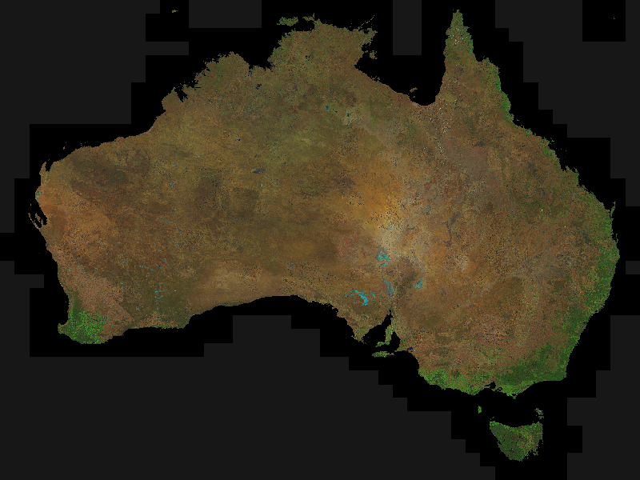
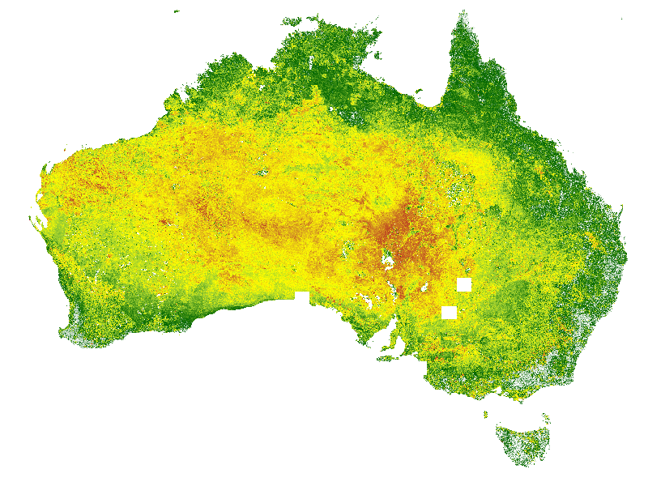

.. toctree::
   :maxdepth: 2

API Applications
================

Bare Soil
+++++++++

Overview
--------

In areas of little vegetation Landsat TM/ETM+ imagery has proven to be very effective in mapping lithologies and weathered
materials including the distribution of iron oxides, clays and silica.

The Enhanced Mineral and Regolith Mapping (aka Bare Soil) application aims to select pixels through time that have a high
bare earth component (i.e. low green and dry vegetation) and from this compile corresponding Surface Reflectance composite
dataset.

The bare soil application workflow can be summarised as:

* identify the relevant fractional cover datasets; and for each dataset
* apply standard Pixel Quality masking to mask out pixel values affected by contiguity issues, saturation issues, cloud and cloud shadow;
* apply additional masking to mask out pixels with an NDVI value (derived from the corresponding Surface Reflectance dataset) outside of the 0.0 - 0.3 range;
* apply additional masking to mask out pixels classified as water by the Water Observations From Space algorithm;
* apply additional masking to mask out pixels whose Fractional Cover / Bare Soil percentage value is outside the 0% - 80% range;
* select the acquisition that represents the maximum value of the Fractional Cover / Bare Soil percentage from the remaining unmasked pixel time series and output a corresponding composite mosaic of:

  * Surface Reflectance;
  * Fractional Cover;
  * Pixel Provenance datasets detailing:

    * the date the selected pixel value was acquired;
    * the satellite that acquired the selected pixel.

Output Products
---------------

Initial continental scale runs (i.e. all of continental Australia covering lat/lon 110/-45 to 155/-10) for all
Landsat 5 & 7 acquisitions have been produced.

Additional targeted outputs, including pixel level statistics and time series band stacks, have been produced for
the following lat/lon cells:

* 120/-20
* 123/-25
* 135/-18
* 142/-22
* 146/-34

Landsat Clean Pixel Mosaic
++++++++++++++++++++++++++

Overview
--------

Geoscience Australia makes available a cloud free mosaic of systematically radiometric and geometric accurate Landsat
surface reflectance imagery.  This image is made available to external stakeholders, as well as being used internally by
Geoscience Australia - for example as a backdrop in the
`Sentinel National Bushfire Monitoring System <http://sentinel.ga.gov.au>`_ system.  The current image of choice is
derived from Landsat 5 & 7 data acquired in 2006.

The goal of the Landsat Clean Pixel Mosaic is to provide an automated process where an up-to-date clean pixel mosaic
of, for example, Landsat 8 Surface Reflectance imagery could be produced on a regular basis (e.g. weekly) as the imagery
is acquired by Geoscience Australia.

The Landsat Clean Pixel Mosaic workflow can be summarised as:

* identify the relevant datasets (typically all Landsat 8 Surface Reflectance datasets);
* start with an empty composite mosaic image;
* process each dataset in order of acquisition, most recent first;
* copy all clean (as per the Pixel Quality Assessment of contiguity, saturation, cloud and cloud shadow) pixels from the current dataset where the corresponding pixel in the composite is currently not populated;
* until all pixels in the composite dataset are populated or the supply of datasets is exhausted.

Output Products
---------------

The output is a clean pixel composite image of continental Australia that can be delivered via file (GeoTIFF, ECW, ...) or via web services (OGC WMS/WCS)...

    Most Recent Clean Pixel Landsat 8 Surface Reflectance composite mosaic

Wetness in the Landscape
++++++++++++++++++++++++

Overview
--------

The Wetness in the Landscape application (WITL) aims to support a deeper understanding of a range of groundwater
issues, including groundwater recharge/discharge processes and, in the longer term, understanding issues of loading
and/or deformation in the landscape.

A key component of the WITL application is the ability to apply a Tasseled Cap Transformation to Landsat Surface
Reflectance data to produce, at least, the Tasseled Cap Wetness Index (TCWI).

As well as the detailed TWCI datasets, statistical summaries of the TWCI data over time are produced.

The WITL application workflow can be summarised as:

* identify the relevant surface reflectance datasets; and for each dataset
* apply standard Pixel Quality masking to mask out pixel values affected by contiguity issues, saturation issues, cloud and cloud shadow;
* apply the Tasseled Cap Transform to the Surface Reflectance dataset to produce the TWCI dataset;
* produce a statistical summary of the TWCI values for each pixel for given time slices within the time period (for example, monthly, quarterly, yearly, complete time period).

Output Products
---------------

The initial output products include data acquired from Landsat 5 & 7 allowing comparisons of:

* The Lower Darling (lat/lon 140/-36 to 145/-30):

 * 2006-2009; versus
 * 2010-2012

* The Ord River Scheme (lat/lon 127/-18 to 130/-14) 2006-2013:

 * Wet Season (November to March); versus
 * Dry Season (April to October)

CRCSI Big Data for Environmental Monitoring Applications
++++++++++++++++++++++++++++++++++++++++++++++++++++++++

Overview
--------

A set of capabilities are being developed and expanded to meet the needs of the
*CRCSI Big Data for Environmental Monitoring* project.

The current capabilities include:

* the ability to summarise one or more data attributes for a given area of interest over time;
* the ability to summarise one or more data attributes at a per pixel level for a given spatial and temporal range;

Area of Interest Level Summary
##############################

The *Area of Interest Summary* workflow can be summarised as:

* identify the relevant datasets; and for each dataset
* apply standard Pixel Quality masking to make out pixel values affected by contiguity, saturation issues, cloud and cloud shadow;
* optionally apply other relevant masking (for example masking of pixels classified as water by the *Water Observations from Space* algorithm);
* apply an *Area of Interest* masking of pixels outside the given area of interest (for example, specified as a polygon in a vector file);
* for the remaining un-masked pixels calculate, over the area of interest, minimum, maximum and mean values

Pixel Level Summary
###################

The *Pixel Level Summary* workflow can be summarised as:

* identify the relevant datasets; and for each dataset
* apply standard Pixel Quality masking to mask out pixel values affected by contiguity issues, saturation issues, cloud and cloud shadow;
* optionally apply other relevant masking (for example masking of pixels classified as water by the *Water Observations from Space* algorithm);
* produce a statistical summary of the value(s) of each pixel for given time slices within the time period (for example, monthly, quarterly, yearly, complete time period).

Output Products
---------------

Area of Interest Level Summary
##############################

The initial outputs were produced from the Landsat 5 & 7 data acquired from 1987 to 2014 with the
following values for a set of areas of interest reported upon:

* Surface reflectance:
  * all values

* Fractional cover:
  * Photosynthetic vegetation
  * Non-photosynthetic vegetation
  * Bare soil

A, CSV format, time series output was produced which reported:

* acquisition date;
* instrument (aka Landsat 5/TM, Landsat 7/ETM+);
* number of pixels in the aggregation of cells covering the area of interest;
* number of pixels in the area of interest;

and then for each data attribute reported upon:

* number of data pixels;
* number of data pixels after applying PQA masking;
* number of data pixels after applying PQA + water masking;
* number of data pixels after applying PQA + water + AOI masking;
* minimum value;
* maximum value;
* mean value

.. figure:: crcsi_csv.png

  Example of *Bare Soil Fraction* CSV output

.. figure:: crcsi_graph.png

  Example of *Bare Soil Fraction* mean value over time graph

Pixel Level Summary
###################

The initial output products were produced from the Landsat - 5, 7 & 8 - Fractional Cover datasets:

* Photosynthetic Vegetation Fraction:

  * Landsat 5 & 7 acquired during 2005
  * Landsat 8 acquired during 2014

* Bare Soil Fraction:

  * Landsat 5 & 7 acquired during 2005
  * Landsat 8 acquired during 2014

All available datasets with full Pixel Quality Masking were utilised to produce an output rasters containing the following summary values:

* Total number of times the pixel was observed
* Number of times the pixel was *clearly* observed (i.e. no contiguity, saturation issues, no cloud/cloud shadow);
* Minimum
* Maximum
* Mean
* 25\ :superscript:`th`, 50\ :superscript:`th`, 75\ :superscript:`th`, 90\ :superscript:`th` and 95\ :superscript:`th` percentiles

The outputs can be delivered via file (GeoTIFF, ECW, ...) or via web services (OGC WMS/WCS)...

.. figure:: crcsi_march_photosynthetic_veg_ls57_2005.png

    Visualisation of the 95\ :superscript:`th` percentile of the *Photosynthetic Vegetation Fraction* - Landsat 5 & 7 data acquired in 2005

.. figure:: crcsi_march_photosynthetic_veg_ls8_2014.png

    Visualisation of the 95\ :superscript:`th` percentile of the *Photosynthetic Vegetation Fraction* - Landsat 8 data acquired in 2014

.. figure:: crcsi_march_bare_soil_ls57_2005.png

    Visualisation of the 95\ :superscript:`th` percentile of the *Bare Soil Fraction* - Landsat 5 & 7 data acquired in 2005

    Visualisation of the 95\ :superscript:`th` percentile of the *Bare Soil Fraction* - Landsat 8 data acquired in 2014

Indices and tables
==================

* :ref:`genindex`
* :ref:`modindex`
* :ref:`search`